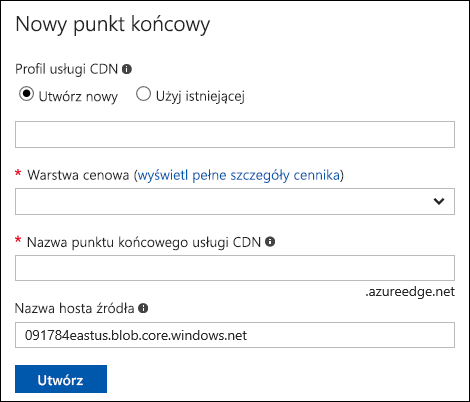

# Integracja statycznej witryny sieci Web z usługą Azure CDN

Można włączyć [usługę Azure Content Delivery Network (CDN)](../../cdn/cdn-overview.md) do buforowania zawartości ze [statycznej witryny sieci Web,](storage-blob-static-website.md) która jest hostowana na koncie magazynu platformy Azure. Za pomocą usługi Azure CDN można skonfigurować niestandardowy punkt końcowy domeny dla statycznej witryny sieci Web, aprowizować niestandardowe certyfikaty TLS/SSL i skonfigurować niestandardowe reguły przepisywania. Konfigurowanie usługi Azure CDN oznacza dodatkowe koszty, ale zapewnia stale niskie opóźnienia połączenia z witryną internetowej z dowolnego miejsca na świecie. Usługa Azure CDN zapewnia również szyfrowanie TLS z własnym certyfikatem. 

Aby uzyskać dodatkowe informacje na temat cennika usługi Azure CDN, zobacz [Cennik usługi Content Delivery Network](https://azure.microsoft.com/pricing/details/cdn/).

## Włącz usługę Azure CDN dla swojej statycznej witryny sieci Web

Można włączyć usługę Azure CDN dla statycznej witryny sieci Web bezpośrednio z konta magazynu. wysJeśli chcesz określić zaawansowane ustawienia konfiguracji dla punktu końcowego usługi CDN, takie jak [optymalizacja pobierania dużych plików](../../cdn/cdn-optimization-overview.md#large-file-download), możesz zamiast tego użyć [rozszerzenia usługi Azure CDN](../../cdn/cdn-create-new-endpoint.md), aby utworzyć punkt końcowy i profil usługi CDN.

1. Znajdź swoje konto magazynu w witrynie Azure portal i wyświetl omówienie konta.

2. Wybierz pozycję **Azure CDN** w menu **Blob Service**, aby skonfigurować usługę Azure CDN.

    Zostanie wyświetlona strona **Azure CDN**.

    

3. W sekcji **profilu sieci CDN** określ nowy lub istniejący profil sieci CDN. 

4. Określ warstwę cenową dla punktu końcowego sieci CDN. Aby dowiedzieć się więcej o cenach, zobacz [Cennik sieci dostarczania zawartości](https://azure.microsoft.com/pricing/details/cdn/). Aby uzyskać więcej informacji na temat funkcji dostępnych dla każdej warstwy, zobacz [Porównanie funkcji produktu usługi Azure CDN](../../cdn/cdn-features.md).

5. W polu **nazwa punktu końcowego sieci CDN** określ nazwę punktu końcowego sieci CDN. Punkt końcowy usługi CDN musi być unikatowy na platformie Azure.

6. Określ, że jesteś statycznym punktem końcowym witryny w polu **Nazwa hosta pochodzenia.** 

   Aby znaleźć statyczny punkt końcowy witryny sieci Web, przejdź do ustawień **statycznej witryny sieci Web** dla konta magazynu.  Skopiuj podstawowy punkt końcowy i wklej go do konfiguracji sieci CDN.

   > [!IMPORTANT]
   > Upewnij się, że usuniesz identyfikator protokołu *(np.* https) i końcowe ukośnik w adresie URL. Na przykład, jeśli statyczny punkt `https://mystorageaccount.z5.web.core.windows.net/`końcowy witryny `mystorageaccount.z5.web.core.windows.net` sieci Web jest , a następnie należy określić w **polu Nazwa hosta pochodzenia.**

   Na poniższej ilustracji przedstawiono przykładową konfigurację punktu końcowego:

   

7. Wybierz **pozycję Utwórz**, a następnie poczekaj, aż będzie propagować. Po utworzeniu punktu końcowego zostanie on wyświetlony na liście punktów końcowych.

8. Aby sprawdzić, czy punkt końcowy sieci CDN jest poprawnie skonfigurowany, kliknij punkt końcowy, aby przejść do jego ustawień. Z omówienia sieci CDN dla konta magazynu znajdź nazwy hosta punktu końcowego i przejdź do punktu końcowego, jak pokazano na poniższej ilustracji. Format punktu końcowego sieci CDN `https://staticwebsitesamples.azureedge.net`będzie podobny do .

    

9. Po zakończeniu propagacji punktu końcowego sieci CDN przejście do punktu końcowego sieci CDN powoduje wyświetlenie zawartości pliku index.html, który został wcześniej przesłany do statycznej witryny sieci Web.

10. Aby przejrzeć ustawienia pochodzenia punktu końcowego sieci CDN, przejdź do **punktu początkowego w** sekcji **Ustawienia** dla punktu końcowego sieci CDN. Zobaczysz, że pole **typu Pochodzenie** jest ustawione na *Niestandardowe pochodzenie* i że pole nazwa **hosta pochodzenia** wyświetla statyczny punkt końcowy witryny sieci Web.

    

## Usuwanie zawartości z usługi Azure CDN

Jeśli nie chcesz już buforować obiektu w usłudze Azure CDN, możesz wykonać jedną z następujących czynności:

* Ustaw kontener jako prywatny, a nie publiczny. Aby uzyskać więcej informacji, zobacz [Zarządzanie anonimowym dostępem do odczytu kontenerów i obiektów blob.](storage-manage-access-to-resources.md)
* Wyłącz lub usuń punkt końcowy usługi CDN przy użyciu witryny Azure Portal.
* Zmodyfikuj usługę hostowaną w taki sposób, aby nie odpowiadała już na żądania dla obiektu.

Obiekt, który jest już buforowany w usłudze Azure CDN, pozostaje w pamięci podręcznej, dopóki nie zakończy się okres czasu wygaśnięcia dla obiektu lub dopóki punkt końcowy nie zostanie [przeczyszczony](../../cdn/cdn-purge-endpoint.md). Po zakończeniu okresu czasu wygaśnięcia usługa Azure CDN określa, czy punkt końcowy usługi CDN jest nadal ważny i czy obiekt jest nadal anonimowo dostępny. Jeżeli tak nie jest, obiekt nie będzie już buforowany.

## Następne kroki

(Opcjonalnie) Dodaj domenę niestandardową do punktu końcowego usługi Azure CDN. Zobacz [Samouczek: Dodawanie domeny niestandardowej do punktu końcowego usługi Azure CDN](../../cdn/cdn-map-content-to-custom-domain.md).
