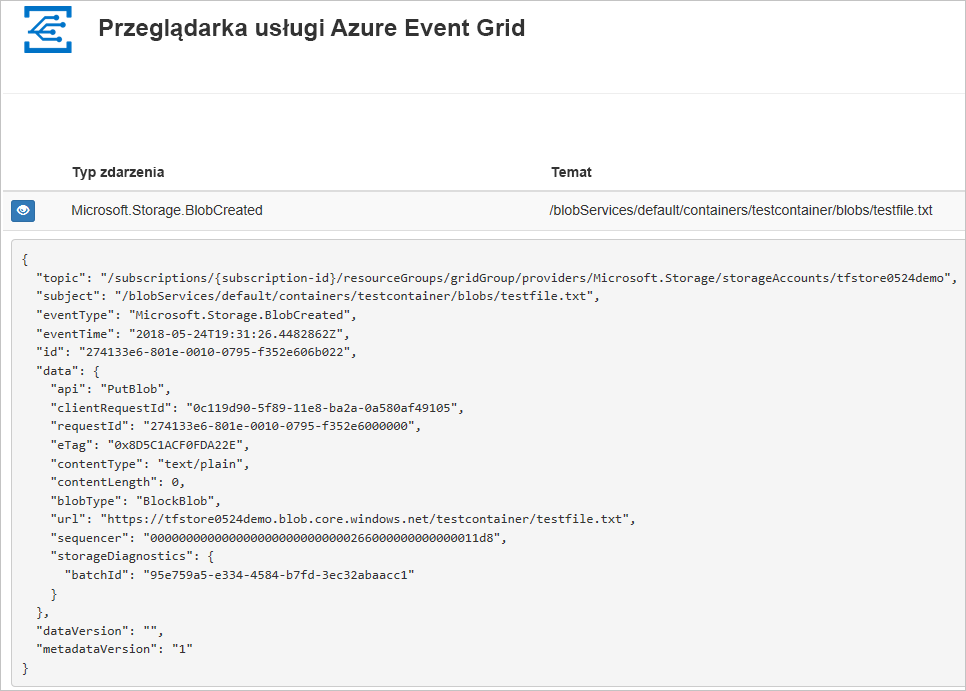
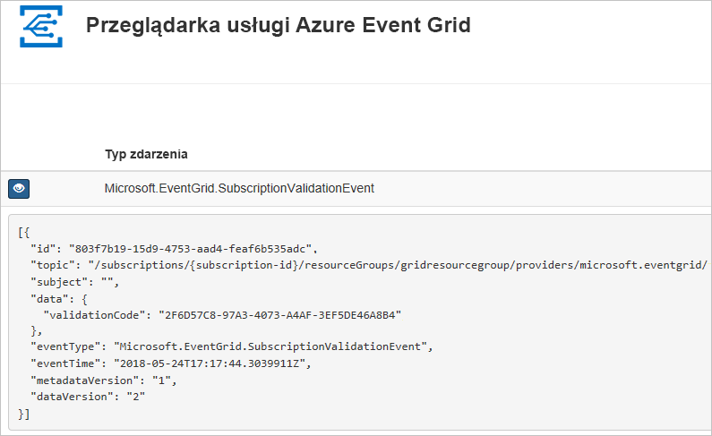

# <a name="quickstart-route-storage-events-to-web-endpoint-with-azure-cli"></a>Szybki start: Kierowanie zdarzeń usługi magazynu do internetowego punktu końcowego za pomocą interfejsu Azure CLI

Azure Event Grid to usługa obsługi zdarzeń dla chmury. W tym artykule omówiono subskrybowanie zdarzeń usługi Blob Storage i wyzwalanie zdarzenia w celu wyświetlenia wyniku za pomocą interfejsu wiersza polecenia platformy Azure.

Zazwyczaj użytkownik wysyła zdarzenia do punktu końcowego, w którym następuje przetwarzanie danych zdarzenia i są wykonywane akcje. Jednak aby uprościć ten artykuł, zdarzenia zostaną wysłane do aplikacji sieci Web, która zbiera i wyświetla komunikaty.

Po wykonaniu czynności opisanych w tym artykule dane powinny zostać wysłane do aplikacji internetowej.



[!INCLUDE [quickstarts-free-trial-note.md](../../../includes/quickstarts-free-trial-note.md)]

[!INCLUDE [cloud-shell-try-it.md](../../../includes/cloud-shell-try-it.md)]

Jeśli zdecydujesz się zainstalować interfejs wiersza polecenia i korzystać z niego lokalnie, ten artykuł będzie wymagał interfejsu Azure CLI w najnowszej wersji (2.0.24 lub nowszej). Aby dowiedzieć się, jaka wersja jest używana, uruchom polecenie `az --version`. Jeśli konieczna będzie instalacja lub uaktualnienie, zobacz [Instalowanie interfejsu wiersza polecenia platformy Azure](/cli/azure/install-azure-cli).

Jeśli nie korzystasz z usługi Cloud Shell, musisz się najpierw zalogować za pomocą polecenia `az login`.

## <a name="create-a-resource-group"></a>Tworzenie grupy zasobów

Tematy usługi Event Grid to zasoby platformy Azure i muszą być umieszczone w grupie zasobów platformy Azure. Grupa zasobów to kolekcja logiczna przeznaczona do wdrażania zasobów platformy Azure i zarządzania nimi.

Utwórz grupę zasobów za pomocą polecenia [az group create](/cli/azure/group). 

Poniższy przykład obejmuje tworzenie grupy zasobów o nazwie `<resource_group_name>` w lokalizacji *westcentralus*.  Zamień `<resource_group_name>` na unikatową nazwę grupy zasobów.

```azurecli-interactive
az group create --name <resource_group_name> --location westcentralus
```

## <a name="create-a-storage-account"></a>Tworzenie konta magazynu

Zdarzenia usługi Blob Storage są dostępne na kontach magazynu ogólnego przeznaczenia w wersji 2 i kontach usługi Blob Storage. Konta magazynu **ogólnego przeznaczenia w wersji 2** obsługują wszystkie funkcje wszystkich usług magazynu, w tym usług Blobs, Files, Queues i Tables. **Konto usługi Blob Storage** to specjalne konto magazynu służące do przechowywania danych niestrukturalnych w formie obiektów blob w usłudze Azure Storage. Konta usługi Blob Storage przypominają konta magazynu ogólnego przeznaczenia i udostępniają wszystkie używane obecnie funkcje doskonałej trwałości, dostępności, skalowalności i wydajności, łącznie z pełną spójnością interfejsu API na potrzeby blokowych obiektów blob i obiektów blob dołączania. Aby uzyskać więcej informacji, zobacz [Omówienie konta magazynu platformy Azure](../common/storage-account-overview.md).

Zamień `<storage_account_name>` na unikatową nazwę konta magazynu oraz `<resource_group_name>` na wcześniej utworzoną grupę zasobów.

```azurecli-interactive
az storage account create \
  --name <storage_account_name> \
  --location westcentralus \
  --resource-group <resource_group_name> \
  --sku Standard_LRS \
  --kind BlobStorage \
  --access-tier Hot
```

## <a name="create-a-message-endpoint"></a>Tworzenie punktu końcowego komunikatów

Przed zasubskrybowaniem tematu utwórzmy punkt końcowy dla komunikatów o zdarzeniach. Zazwyczaj w punkcie końcowym akcje są wykonywane na podstawie danych zdarzenia. Aby uprościć ten przewodnik Szybki Start, wdrożysz [wstępnie zbudowaną aplikację sieci Web](https://github.com/Azure-Samples/azure-event-grid-viewer), która będzie wyświetlać komunikaty o zdarzeniach. Wdrożone rozwiązanie zawiera plan usługi App Service, aplikację internetową usługi App Service i kod źródłowy z repozytorium GitHub.

Zastąp `<your-site-name>` unikatową nazwą aplikacji sieci Web. Nazwa aplikacji sieci Web musi być unikatowa, ponieważ stanowi część wpisu DNS.

```azurecli-interactive
sitename=<your-site-name>

az group deployment create \
  --resource-group <resource_group_name> \
  --template-uri "https://raw.githubusercontent.com/Azure-Samples/azure-event-grid-viewer/master/azuredeploy.json" \
  --parameters siteName=$sitename hostingPlanName=viewerhost
```

Wdrożenie może potrwać kilka minut. Po pomyślnym wdrożeniu należy wyświetlić aplikację sieci Web i upewnić się, że jest uruchomiona. W przeglądarce sieci Web przejdź do: `https://<your-site-name>.azurewebsites.net`

Powinna być widoczna witryna internetowa bez żadnych aktualnie wyświetlanych komunikatów.

[!INCLUDE [event-grid-register-provider-cli.md](../../../includes/event-grid-register-provider-cli.md)]

## <a name="subscribe-to-your-storage-account"></a>Subskrybowanie konta magazynu

Subskrybowanie tematu to dla usługi Event Grid informacja o tym, które zdarzenia chcesz śledzić i gdzie mają być one wysyłane. Poniższy przykład ilustruje subskrybowanie utworzonego konta magazynu i przekazanie adresu URL z aplikacji internetowej jako punktu końcowego dla powiadomień o zdarzeniach. Zastąp element `<event_subscription_name>` nazwą Twojej subskrypcji zdarzeń. Jako parametrów `<resource_group_name>` i `<storage_account_name>` użyj utworzonych wcześniej wartości.

Punkt końcowy dla aplikacji sieci Web musi zawierać sufiks `/api/updates/`.

```azurecli-interactive
storageid=$(az storage account show --name <storage_account_name> --resource-group <resource_group_name> --query id --output tsv)
endpoint=https://$sitename.azurewebsites.net/api/updates

az eventgrid event-subscription create \
  --resource-id $storageid \
  --name <event_subscription_name> \
  --endpoint $endpoint
```

Wyświetl aplikację sieci Web ponownie i zwróć uwagę, że zdarzenie sprawdzania poprawności subskrypcji zostało do niej wysłane. Wybierz ikonę oka, aby rozwinąć dane zdarzenia. Usługa Event Grid wysyła zdarzenie weryfikacji, aby w punkcie końcowym mogło nastąpić sprawdzenie, czy dane zdarzenia mają być odbierane. Aplikacja sieci Web zawiera kod do sprawdzania poprawności subskrypcji.



## <a name="trigger-an-event-from-blob-storage"></a>Wyzwalanie zdarzenia z usługi Blob Storage

Teraz wyzwólmy zdarzenie, aby zobaczyć, jak usługa Event Grid dystrybuuje komunikat do punktu końcowego. Najpierw skonfigurujemy nazwę i klucz konta magazynu, a następnie utworzymy kontener oraz utworzymy i przekażemy plik. Jako parametrów `<storage_account_name>` i `<resource_group_name>` ponownie użyj utworzonych wcześniej wartości.

```azurecli-interactive
export AZURE_STORAGE_ACCOUNT=<storage_account_name>
export AZURE_STORAGE_ACCESS_KEY="$(az storage account keys list --account-name <storage_account_name> --resource-group <resource_group_name> --query "[0].value" --output tsv)"

az storage container create --name testcontainer

touch testfile.txt
az storage blob upload --file testfile.txt --container-name testcontainer --name testfile.txt
```

Zdarzenie zostało wyzwolone, a usługa Event Grid wysłała komunikat do punktu końcowego skonfigurowanego podczas subskrybowania. Wyświetl aplikację sieci Web, aby wyświetlić właśnie wysłane zdarzenie.


```json
[{
  "topic": "/subscriptions/xxxxxxxx-xxxx-xxxx-xxxx-xxxxxxxxxxxx/resourceGroups/myrg/providers/Microsoft.Storage/storageAccounts/myblobstorageaccount",
  "subject": "/blobServices/default/containers/testcontainer/blobs/testfile.txt",
  "eventType": "Microsoft.Storage.BlobCreated",
  "eventTime": "2017-08-16T20:33:51.0595757Z",
  "id": "4d96b1d4-0001-00b3-58ce-16568c064fab",
  "data": {
    "api": "PutBlockList",
    "clientRequestId": "d65ca2e2-a168-4155-b7a4-2c925c18902f",
    "requestId": "4d96b1d4-0001-00b3-58ce-16568c000000",
    "eTag": "0x8D4E4E61AE038AD",
    "contentType": "text/plain",
    "contentLength": 0,
    "blobType": "BlockBlob",
    "url": "https://myblobstorageaccount.blob.core.windows.net/testcontainer/testblob1.txt",
    "sequencer": "00000000000000EB0000000000046199",
    "storageDiagnostics": {
      "batchId": "dffea416-b46e-4613-ac19-0371c0c5e352"
    }
  },
  "dataVersion": "",
  "metadataVersion": "1"
}]

```

## <a name="clean-up-resources"></a>Oczyszczanie zasobów
Jeśli zamierzasz kontynuować pracę z tym kontem magazynu i tą subskrypcją zdarzeń, nie usuwaj zasobów utworzonych w tym artykule. Jeśli nie planujesz kontynuowania pracy, użyj poniższego polecenia, aby usunąć zasoby utworzone w ramach tego artykułu.

Zamień `<resource_group_name>` na utworzoną powyżej grupę zasobów.

```azurecli-interactive
az group delete --name <resource_group_name>
```

## <a name="next-steps"></a>Następne kroki

Wiesz już, jak tworzyć tematy i subskrypcje zdarzeń. Dowiedz się więcej na temat tego, co mogą Ci ułatwić zdarzenia usługi Blob Storage i usługa Event Grid:

- [Reagowanie na zdarzenia usługi Blob Storage](storage-blob-event-overview.md)
- [Event Grid — informacje](../../event-grid/overview.md)
