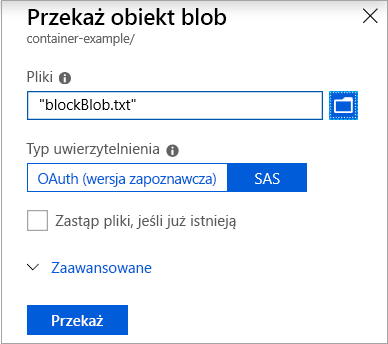

# Szybki start: przekazywanie, pobieranie i wyświetlanie listy obiektów blob za pomocą witryny Azure Portal

Dzięki temu przewodnikowi Szybki start dowiesz się, w jaki sposób za pomocą witryny [Azure portal](https://portal.azure.com/) tworzyć kontener w usłudze Azure Storage oraz przekazywać i pobierać blokowe obiekty blob w ramach tego kontenera.

## Wymagania wstępne

Jeśli nie masz subskrypcji platformy Azure, przed rozpoczęciem utwórz [bezpłatne konto](https://azure.microsoft.com/free/?WT.mc_id=A261C142F).

[!INCLUDE [storage-create-account-portal-include](../../../includes/storage-create-account-portal-include.md)]

## Tworzenie kontenera

Aby utworzyć kontener w witrynie Azure Portal, wykonaj następujące kroki:

1. W witrynie Azure Portal przejdź do swojego nowego konta magazynu.
2. W lewym menu dla konta magazynu przewiń do sekcji **Blob Service**, a następnie wybierz pozycję **Przeglądaj obiekty blob**.
3. Kliknij przycisk **Dodaj kontener**.
4. Wprowadź nazwę nowego kontenera. Nazwa kontenera musi być zapisana małymi literami, zaczynać się literą lub cyfrą i może zawierać tylko litery, cyfry i znak kreski (-). Aby uzyskać dodatkowe informacje o regułach nazewnictwa kontenerów i obiektów blob, zobacz [Nazewnictwo i odwoływanie się do kontenerów, obiektów blob i metadanych](https://docs.microsoft.com/rest/api/storageservices/naming-and-referencing-containers--blobs--and-metadata).
5. Ustaw poziom dostępu publicznego do kontenera. Domyślny poziom to **Prywatny (bez dostępu anonimowego)**.
6. Kliknij przycisk **OK**, aby utworzyć kontener.

    

## Przekazywanie blokowego obiektu blob

Blokowe obiekty blob składają się z bloków danych złożonych w celu utworzenia obiektu blob. W większości scenariuszy dotyczących użycia usługi Blob Storage używane są blokowe obiekty blob. Blokowe obiekty blob idealnie nadają się do przechowywania tekstu i danych binarnych w chmurze, takich jak pliki, obrazy lub filmy wideo. W tym przewodniku Szybki start przedstawiono sposób pracy z blokowymi obiektami blob. 

Aby przekazać blokowy obiekt blob do nowego kontenera w witrynie Azure Portal, wykonaj następujące kroki:

1. W witrynie Azure Portal przejdź do kontenera utworzonego w poprzedniej sekcji.
2. Wybierz kontener, aby wyświetlić listę obiektów blob, które zawiera. Ponieważ w tym przypadku został utworzony nowy kontener, nie będzie on jeszcze zawierać żadnych obiektów blob.
3. Kliknij przycisk **Przekaż**, aby przekazać obiekt blob do kontenera.
4. Przeglądaj swój lokalny system plików, aby znaleźć plik do przekazania jako blokowy obiekt blob, a następnie kliknij przycisk **Przekaż**.
     
    

5. Przekaż w ten sposób dowolną liczbę obiektów blob. Nowe obiekty blob zostaną wyświetlone w kontenerze.

    

## Pobieranie blokowego obiektu blob

Blokowy obiekt blob możesz pobrać, aby wyświetlić go w przeglądarce lub zapisać w lokalnym systemie plików. Aby pobrać blokowy obiekt blob, wykonaj następujące kroki:

1. Przejdź do listy obiektów blob przekazanych w poprzedniej sekcji. 
2. Wybierz obiekt blob do pobrania.
3. Kliknij prawym przyciskiem myszy przycisk **Więcej** (**...** ), a następnie wybierz pozycję **Pobierz**. 

## Oczyszczanie zasobów

Aby usunąć zasoby utworzone w tym przewodniku Szybki start, możesz po prostu usunąć kontener. Wszystkie obiekty blob w kontenerze również zostaną usunięte.

Aby usunąć kontener:

1. W witrynie Azure Portal przejdź do listy kontenerów w ramach swojego konta magazynu.
2. Wybierz kontener do usunięcia.
3. Kliknij prawym przyciskiem myszy przycisk **Więcej** (**...** ), a następnie wybierz pozycję **Usuń**.
4. Potwierdź, że chcesz usunąć kontener.

       

## Następne kroki

W tym przewodniku Szybki start przedstawiono metodę transferowania plików między dyskiem lokalnym i usługą Azure Blob Storage przy użyciu platformy .NET. Aby dowiedzieć się więcej na temat pracy z usługą Blob Storage, przejdź do instrukcji dotyczących magazynu obiektów blob.

> [!div class="nextstepaction"]
> [Instrukcje: Operacje wykonywane w usłudze Blob Storage](storage-dotnet-how-to-use-blobs.md)

