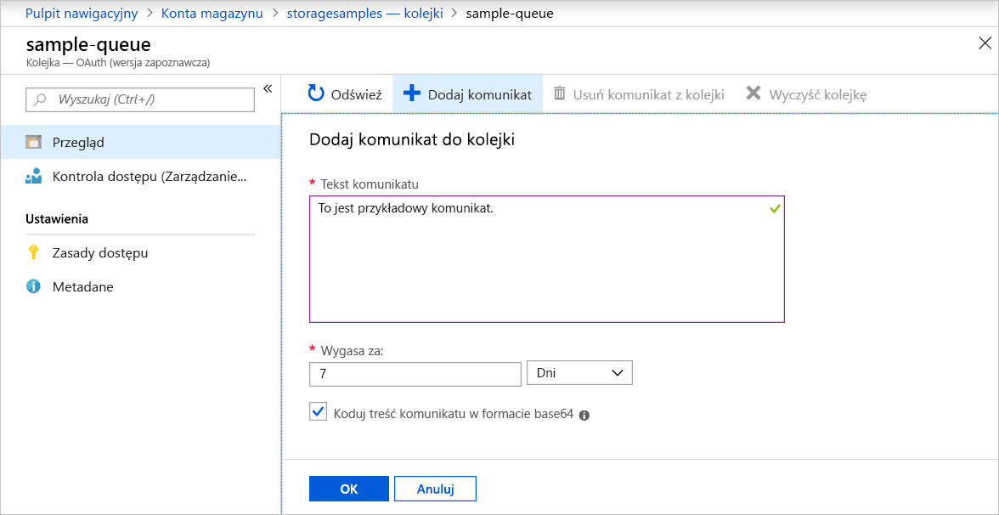

# Szybki Start: Tworzenie kolejki i Dodawanie komunikatu z Azure Portal

W tym przewodniku Szybki start dowiesz się, jak używać witryny [Azure Portal](https://portal.azure.com/) do tworzenia kolejki w usłudze Azure Storage oraz do dodawania komunikatów do kolejki i usuwania ich z kolejki.

## Wymagania wstępne

[!INCLUDE [storage-quickstart-prereq-include](../../../includes/storage-quickstart-prereq-include.md)]

## Tworzenie kolejki

Aby utworzyć kolejkę w witrynie Azure Portal, wykonaj następujące kroki:

1. W witrynie Azure Portal przejdź do swojego nowego konta magazynu.
2. W menu po lewej stronie dla konta magazynu przewiń do sekcji **Usługa kolejki**, a następnie wybierz pozycję **Kolejki**.
3. Wybierz przycisk **+ Kolejka**.
4. Wpisz nazwę nowej kolejki. Nazwa kolejki musi być zapisana małymi literami, zaczynać się literą lub cyfrą i może zawierać tylko litery, cyfry i znak kreski (-).
6. Wybierz przycisk **OK**, aby utworzyć kolejkę.

    

## Dodawanie komunikatu

Następnie dodaj komunikat do nowej kolejki. Maksymalny rozmiar komunikatu wynosi 64 KB.

1. Wybierz nową kolejkę z listy kolejek na koncie magazynu.
1. Wybierz przycisk **+ Dodaj komunikat**, aby dodać komunikat do kolejki. Wprowadź komunikat w polu **Tekst komunikatu**. 
1. Określ termin wygaśnięcia ważności komunikatu. Maksymalny czas pozostawania komunikatu w kolejce wynosi 7 dni.
1. Wskaż, czy komunikat ma być kodowany przy użyciu schematu Base64. Kodowanie danych binarnych jest zalecane.
1. Wybierz przycisk **OK**, aby dodać komunikat.

    

## Wyświetlanie właściwości komunikatu

Po dodaniu komunikatu w witrynie Azure Portal zostanie wyświetlona lista wszystkich komunikatów w kolejce. Można wyświetlić identyfikator komunikatu, zawartość komunikatu, czas wstawienia komunikatu i czas wygaśnięcia ważności komunikatu. Można również sprawdzić, ile razy dany komunikat został usunięty z kolejki.

## Usuwanie komunikatu z kolejki

Komunikat można usunąć z początku kolejki w witrynie Azure Portal. Wycofanie komunikatu z kolejki oznacza jego usunięcie. 

Usuwanie z kolejki zawsze dotyczy najstarszego komunikatu. 

## Następne kroki

W tym przewodniku Szybki start przedstawiono sposób tworzenia kolejki, dodawania komunikatu, wyświetlania właściwości komunikatu i usuwania komunikatu z kolejki w witrynie Azure Portal.

> [!div class="nextstepaction"]
> [Co to jest Azure Queues?](storage-queues-introduction.md)
