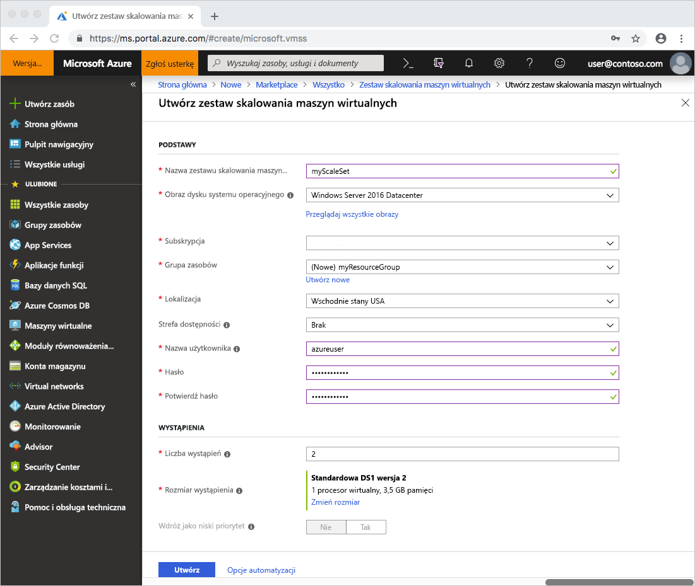

# Szybki start: Tworzenie zestawu skalowania maszyn wirtualnych w witrynie Azure Portal
Zestaw skalowania maszyn wirtualnych umożliwia wdrożenie zestawu identycznych, automatycznie skalowanych maszyn wirtualnych, oraz zarządzanie nimi. Maszyny wirtualne w zestawie skalowania możesz skalować ręcznie lub możesz zdefiniować reguły skalowania automatycznego na podstawie użycia takich zasobów jak procesor CPU, zapotrzebowanie na pamięć lub ruch sieciowy. Moduł równoważenia obciążenia platformy Azure następnie dystrybuuje ruch do wystąpień maszyn wirtualnych w zestawie skalowania. W tym przewodniku Szybki start utworzysz zestaw skalowania maszyn wirtualnych w witrynie Azure Portal.

Jeśli nie masz subskrypcji platformy Azure, przed rozpoczęciem utwórz [bezpłatne konto](https://azure.microsoft.com/free/?WT.mc_id=A261C142F).

## Zaloguj się do platformy Azure.
Zaloguj się do witryny Azure Portal na stronie http://portal.azure.com.

## Tworzenie zestawu skalowania maszyn wirtualnych
Możesz wdrożyć zestaw skalowania z obrazu systemu Windows Server lub obrazu systemu Linux, takiego jak RHEL, CentOS, Ubuntu i SLES.

1. W lewym górnym rogu witryny Azure Portal kliknij przycisk **Utwórz zasób**.
2. Wyszukaj *zestaw skalowania*, wybierz **Zestaw skalowania maszyn wirtualnych**, a następnie wybierz pozycję **Utwórz**.
3. Wprowadź nazwę zestawu skalowania, taką jak *myScaleSet*.
4. Wybierz żądany typ systemu operacyjnego, taki jak *Windows Server 2016 Datacenter*.
5. Wprowadź żądaną nazwę grupy zasobu, taką jak *myResourceGroup*, i lokalizację, taką jak *Wschodnie stany USA*.
6. Wprowadź żądaną nazwę użytkownika, a następnie wybierz typ uwierzytelniania, który preferujesz.
    - **Hasło** musi mieć długość co najmniej 12 znaków i spełniać trzy z czterech następujących wymagań dotyczących złożoności: jedna mała litera, jedna wielka litera, jedna cyfra i jeden znak specjalny. Aby uzyskać więcej informacji, zobacz [wymagania dotyczące nazwy użytkownika i hasła](../virtual-machines/windows/faq.md#what-are-the-username-requirements-when-creating-a-vm).
    - Jeśli wybierzesz obraz dysku systemu operacyjnego Linux, zamiast tego możesz wybrać **klucz publiczny SSH**. Podaj tylko swój klucz publiczny, taki jak *~/.ssh/id_rsa.pub*. Możesz użyć usługi Azure Cloud Shell z portalu, aby [tworzyć i używać kluczy SSH](../virtual-machines/linux/mac-create-ssh-keys.md).

    
1. Wybierz opcję równoważenia obciążenia, taką jak *Moduł równoważenia obciążenia* w obszarze **Wybierz opcje równoważenia obciążenia**. Wprowadź pozostałe szczegóły opcji równoważenia obciążenia. Na przykład w przypadku *modułu równoważenia obciążenia* musisz wprowadzić **nazwę publicznego adresu IP** i **etykietę nazwy domeny**.
1. Wprowadź szczegóły sieci wirtualnej w obszarze **Konfigurowanie sieci wirtualnych**. Na przykład możesz utworzyć nową sieć wirtualną, *myVirtualNetwork*, i nową podsieć *domyślną*.
1. Aby potwierdzić opcje zestawu skalowania, wybierz pozycję **Utwórz**.
    

## Połączenie z maszyną wirtualną w zestawie skalowania
Kiedy tworzysz zestaw skalowania w portalu, jest tworzony moduł równoważenia obciążenia. Reguły translacji adresów sieciowych (NAT) są używane do dystrybucji ruchu do wystąpień zestawu skalowania dla połączenia zdalnego, takiego jak protokół RDP lub SSH.

Aby wyświetlić te reguły NAT i informacje o połączeniu dla wystąpień zestawu skalowania:

1. Wybierz grupę zasobów utworzoną w poprzednim kroku, taką jak *myResourceGroup*.
2. Z listy zasobów wybierz swój **Moduł równoważenia obciążenia**, taki jak *myScaleSetLab*.
3. Z menu po lewej stronie okna wybierz pozycję **Reguły NAT ruchu przychodzącego**.

    

Możesz połączyć się z każdą maszyną wirtualną w zestawie skalowania, korzystając z tych reguł NAT. Każde wystąpienie maszyny wirtualnej zawiera docelowy adres IP i numer portu TCP. Jeśli na przykład docelowy adres IP to *104.42.1.19* i port TCP to *50001*, należy połączyć się z wystąpieniem maszyny wirtualnej w następujący sposób:

- Dla zestawu skalowania systemu Windows połącz się z wystąpieniem maszyny wirtualnej za pomocą protokołu RDP na `104.42.1.19:50001`
- Dla zestawu skalowania systemu Linux połącz się z wystąpieniem maszyny wirtualnej za pomocą protokołu SSH na `ssh azureuser@104.42.1.19 -p 50001`

Po wyświetleniu monitu wprowadź poświadczenia określone w poprzednim kroku podczas tworzenia zestawu skalowania. Wystąpienia zestawu skalowania to zwykłe maszyny wirtualne, z którymi można normalnie wchodzić w interakcje. Aby uzyskać więcej informacji na temat sposobu wdrażania i uruchamiania aplikacji w wystąpieniach zestawu skalowania, zobacz [Wdrażanie aplikacji na zestawach skalowania maszyn wirtualnych](virtual-machine-scale-sets-deploy-app.md)

## Oczyszczanie zasobów
Gdy grupa zasobów, zestaw skalowania i wszystkie pokrewne zasoby nie będą już potrzebne, usuń je. Aby to zrobić, wybierz grupę zasobów dla maszyny wirtualnej i kliknij pozycję **Usuń**.

## Następne kroki
W tym przewodniku Szybki start utworzono podstawowy zestaw skalowania w witrynie Azure Portal. Aby dowiedzieć się więcej, przejdź do samouczka dotyczącego sposobu tworzenia zestawów skalowania maszyn wirtualnych platformy Azure i zarządzania nimi.

> [!div class="nextstepaction"]
> [Tworzenie zestawów skalowania maszyn wirtualnych platformy Azure i zarządzanie nimi](tutorial-create-and-manage-powershell.md)