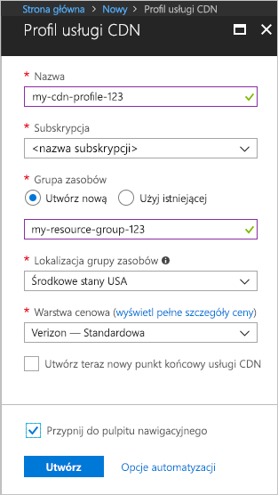

## Tworzenie nowego profilu CDN

Profil usługi CDN jest kontenerem dla punktów końcowych usługi CDN i określa warstwę cenową.

1. W Azure Portal wybierz pozycję **Utwórz zasób** (w lewym górnym rogu). Zostanie wyświetlone okienko **Nowy**.
   
1. Wyszukaj i wybierz pozycję **CDN**, a następnie wybierz pozycję **Utwórz**:
   
    

    Zostanie wyświetlone okienko **profil usługi CDN** .

1. Wprowadź następujące wartości:
   
    | Ustawienie  | Wartość |
    | -------- | ----- |
    | **Nazwa** | W obszarze Nazwa profilu Wprowadź nazwę *CDN-profile-123* . Ta nazwa musi być globalnie unikatowa; Jeśli jest już używana, wprowadź inną nazwę. |
    | **Subskrypcja** | Z listy rozwijanej wybierz subskrypcję platformy Azure. |
    | **Grupa zasobów** | Wybierz pozycję **Utwórz nową** i wprowadź *CDNQuickstart-RG* dla nazwy grupy zasobów lub wybierz opcję **Użyj istniejącej** , a następnie wybierz pozycję *CDNQuickstart-RG* , jeśli istnieje już Grupa. | 
    | **Lokalizacja grupy zasobów** | Wybierz z listy rozwijanej lokalizację znajdującą się obok siebie. |
    | **Warstwa cenowa** | Wybierz **standardową opcję Akamai** z listy rozwijanej. (Czas wdrożenia dla warstwy Akamai jest około jednej minuty. Warstwa firmy Microsoft zajmie około 10 minut, a warstwy Verizon zajmują około 90 minut.) |
    | **Utwórz teraz nowy punkt końcowy CDN** | Pozostaw niezaznaczone. |  
   
    

1. Wybierz pozycję **Utwórz**, aby utworzyć profil.

