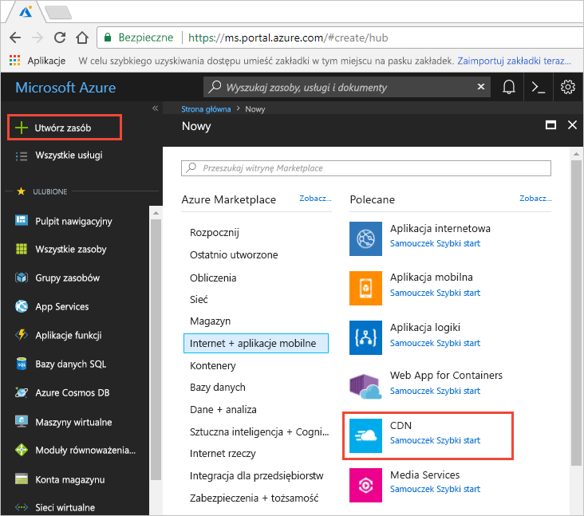

## Tworzenie nowego profilu CDN

Profil CDN jest kontenerem dla punktów końcowych usługi CDN i określa warstwę cenową.

1. W portalu Azure, w lewym górnym rogu wybierz **Utwórz zasób**.
    
    **Nowy** pojawi się okienko.
   
2. Wybierz **sieci Web i mobilność**, następnie **CDN**.
   
    

    **Profilu CDN** pojawi się okienko.

    Użyj ustawień określonych w tabeli po obrazu.
   
    

    | Ustawienie  | Wartość |
    | -------- | ----- |
    | **Nazwa** | Wprowadź *Moje cdn profilu-123* nazwy profilu. Ta nazwa musi być globalnie unikatowe; Jeśli jest już używana, można wprowadzić inny. |
    | **Subskrypcja** | Wybierz subskrypcję platformy Azure z listy rozwijanej.|
    | **Grupa zasobów** | Wybierz **Utwórz nowy** , a następnie wprowadź *Moje zasobów grupy-123* nazwy grupy zasobów. Ta nazwa musi być globalnie unikatowe; Jeśli jest już używana, można wprowadzić inny. | 
    | **Lokalizacja grupy zasobów** | Wybierz **środkowe stany USA** z listy rozwijanej. |
    | **Warstwa cenowa** | Wybierz **standardowe Verizon** z listy rozwijanej. |
    | **Teraz utworzyć nowy punkt końcowy CDN** | Nie zaznaczaj. |  
   
3. Wybierz **Przypnij do pulpitu nawigacyjnego** do zapisania profilu do pulpitu nawigacyjnego po jego utworzeniu.
    
4. Wybierz **Utwórz** do tworzenia profilu. 

