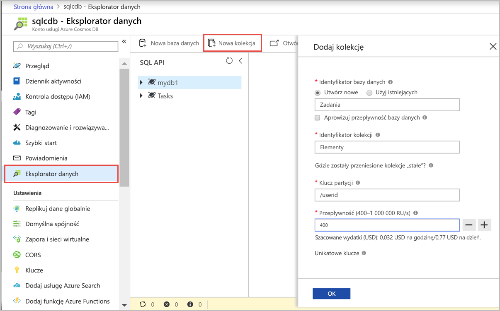

Teraz można użyć narzędzia Eksploratora danych w witrynie Azure portal do tworzenia bazy danych i kontenera. 

1. Wybierz nowy kontener **Eksploratora** > **New Container**danych . 
    
    Obszar **Dodaj kontener** jest wyświetlany po prawej stronie, może być konieczne przewinięcie w prawo, aby go zobaczyć.

    

2. Na stronie **Dodaj kontener** wprowadź ustawienia nowego kontenera.

    |Ustawienie|Sugerowana wartość|Opis
    |---|---|---|
    |**Identyfikator bazy danych**|Zadania|Wprowadź *Zadania* jako nazwę nowej bazy danych. Nazwy baz danych muszą zawierać od 1 do 255 znaków i nie mogą zawierać znaków `/, \\, #, ?` ani mieć spacji na końcu. Sprawdź opcję **przepływność bazy danych aprowizuj,** umożliwia udostępnianie przepływności aprowizowanej do bazy danych we wszystkich kontenerach w bazie danych. Ta opcja pomaga również w oszczędzaniu kosztów. |
    |**Przepływność**|400|Pozostaw przepływność na 400 jednostek żądań na sekundę (RU/s). Jeśli chcesz zmniejszyć opóźnienie, możesz później przeskalować przepływność w górę.| 
    |**Identyfikator kontenera**|Items|Wprowadź *elementy* jako nazwę nowego kontenera. W przypadku identyfikatorów kontenerów obowiązują takie same wymagania dotyczące znaków jak dla nazw baz danych.|
    |**Klucz partycji**| /category| Przykład opisany w tym artykule używa */category* jako klucz partycji.|
    
    Oprócz poprzednich ustawień można opcjonalnie dodać **unikatowe klucze** dla kontenera. W tym przykładzie pozostawmy pole puste. Unikatowe klucze umożliwiają deweloperom dodanie warstwy integralności danych do bazy danych. Tworząc unikatowe zasady klucza podczas tworzenia kontenera, należy zapewnić unikatowość jednej lub więcej wartości na klucz partycji. Aby dowiedzieć się więcej, zapoznaj się z artykułem [Unique keys in Azure Cosmos DB (Unikatowe klucze w usłudze Azure Cosmos DB)](../articles/cosmos-db/unique-keys.md).
    
    Kliknij przycisk **OK**. W Eksploratorze danych zostanie wyświetlona nowa baza danych i nowy kontener.