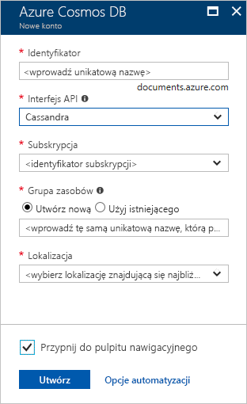

1. W nowym oknie przeglądarki zaloguj się do witryny [Azure Portal](https://portal.azure.com/).
2. Kliknij kolejno pozycje **Utwórz zasób** > **Bazy danych** > **Azure Cosmos DB**.
   
   

3. Na stronie **Nowe konto** wprowadź ustawienia nowego konta usługi Azure Cosmos DB. 
 
    Ustawienie|Sugerowana wartość|Opis
    ---|---|---
    ID|*Wprowadź unikatową nazwę*|Wprowadź unikatową nazwę do identyfikacji tego konta usługi Azure Cosmos DB. Ponieważ adres *cassandra.cosmosdb.azure.com* jest dołączany do podanego identyfikatora w celu utworzenia punktu kontaktowego, użyty identyfikator powinien być unikatowy, ale rozpoznawalny.  Identyfikator może zawierać tylko małe litery, cyfry i znaki łącznika (-) oraz musi zawierać od 3 do 50 znaków.
    Interfejs API|Cassandra|Interfejs API określa typ konta do utworzenia. Usługa Azure Cosmos DB oferuje pięć interfejsów API odpowiadających potrzebom aplikacji: SQL (baza danych dokumentów), Gremlin (baza danych wykresów), MongoDB (baza danych dokumentów), tabela platformy Azure i Cassandra. Każdy z tych interfejsów wymaga obecnie oddzielnego konta.   Wybierz pozycję **Cassandra**, ponieważ w tym podręczniku Szybki start tworzysz bazę danych z wieloma kolumnami. Zapytania dotyczące tej bazy danych można tworzyć w języku CQL.  Jeśli interfejs Cassandra (z wieloma kolumnami) nie jest wyświetlany na liście, musisz [złożyć wniosek o dołączenie](../articles/cosmos-db/cassandra-introduction.md#sign-up-now) do programu wersji zapoznawczej interfejsu API Cassandra.   [Dowiedz się więcej o interfejsie API Cassandra](../articles/cosmos-db/cassandra-introduction.md)|
    Subskrypcja|*Twoja subskrypcja*|Wybierz subskrypcję platformy Azure, która ma być używana dla tego konta usługi Azure Cosmos DB. 
    Grupa zasobów|Tworzenie nowego elementu  *Następnie wprowadź taką samą unikatową nazwę, która została podana powyżej jako identyfikator*|Wybierz pozycję **Utwórz nową**, a następnie wprowadź nazwę nowej grupy zasobów dla konta. Dla uproszczenia można użyć takiej samej nazwy jak identyfikator. 
    Lokalizacja|*Wybierz region najbliżej Twoich użytkowników*|Wybierz lokalizację geograficzną, w której będzie hostowane Twoje konto usługi Azure Cosmos DB. Użyj lokalizacji znajdującej się najbliżej Twoich użytkowników, aby zapewnić im najszybszy dostęp do danych.
    Przypnij do pulpitu nawigacyjnego | Wybierz pozycję | Zaznacz to pole, aby nowe konto bazy danych zostało dodane do pulpitu nawigacyjnego portalu w celu ułatwienia dostępu.

    Następnie kliknij pozycję **Utwórz**.

    

4. Tworzenie konta potrwa kilka minut. Poczekaj, aż w portalu zostanie wyświetlona strona **Gratulacje! Konto usługi Azure Cosmos DB zostało utworzone**.

