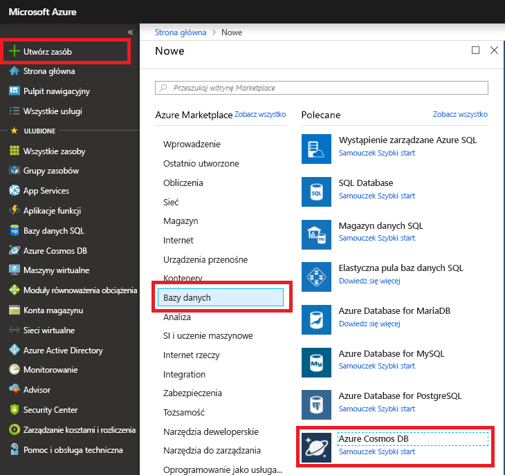
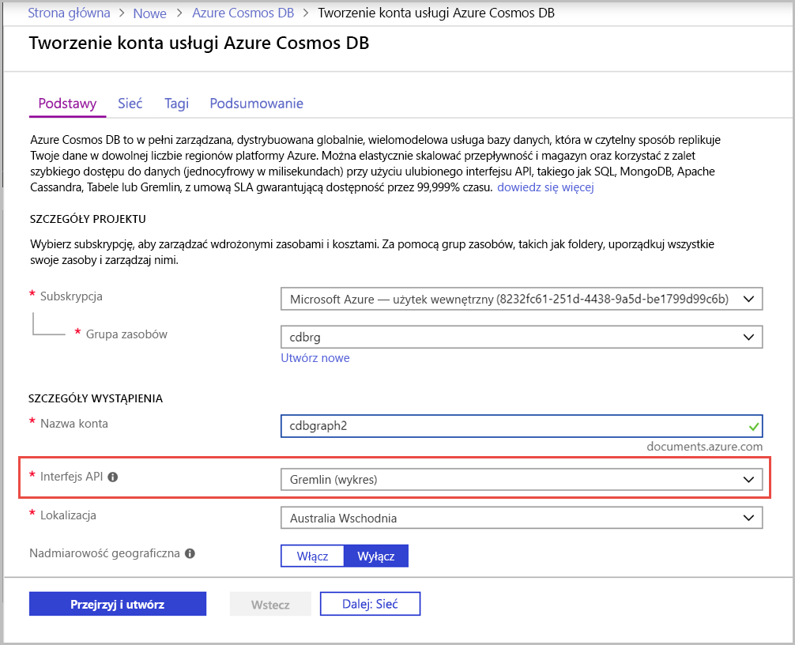

1. W nowym oknie przeglądarki zaloguj się do witryny [Azure Portal](https://portal.azure.com/).

2. W menu po lewej stronie wybierz pozycję **Utwórz zasób**.
   
   
   
3. Na stronie **Nowy** wybierz pozycję **bazy danych** > **Azure Cosmos DB**.
   
   
   
3. Na stronie **Tworzenie konta Azure Cosmos DB** wprowadź ustawienia dla nowego konta Azure Cosmos DB. 
 
    Ustawienie|Wartość|Opis
    ---|---|---
    Subskrypcja|Twoja subskrypcja|Wybierz subskrypcję platformy Azure, której chcesz użyć dla tego konta usługi Azure Cosmos DB. 
    Grupa zasobów|Tworzenie nowego elementu  Następnie wprowadź taką samą nazwę jak nazwa konta|Wybierz pozycję**Utwórz nowy**. Następnie wprowadź nową nazwę grupy zasobów dla swojego konta. Dla uproszczenia Użyj takiej samej nazwy, jak nazwa konta Azure Cosmos DB. 
    Nazwa konta|Wprowadź unikatową nazwę|Wprowadź unikatową nazwę do identyfikacji konta usługi Azure Cosmos DB. Identyfikator URI konta zostanie *Gremlin.Azure.com* dołączony do unikatowej nazwy konta.  Nazwa konta może zawierać tylko małe litery, cyfry i łączniki (-) i musi mieć długość od 3 do 31 znaków.
    Interfejs API|Gremlin (graf)|Interfejs API określa typ konta do utworzenia. Azure Cosmos DB oferuje pięć interfejsów API: Core (SQL) dla baz danych dokumentów, Gremlin dla baz danych programu Graph, MongoDB dla baz danych dokumentów, Azure Table i Cassandra. Należy utworzyć osobne konto dla każdego interfejsu API.   Wybierz pozycję **Gremlin (Graph)** , ponieważ w tym przewodniku szybki start tworzysz tabelę, która współpracuje z interfejsem API Gremlin.   [Dowiedz się więcej o interfejsie API Gremlin](../articles/cosmos-db/graph-introduction.md).|
    Lokalizacja|Wybierz region najbliżej Twoich użytkowników|Wybierz lokalizację geograficzną, w której będzie hostowane konto usługi Azure Cosmos DB. Użyj lokalizacji znajdującej się najbliżej Twoich użytkowników, aby zapewnić im najszybszy dostęp do danych.

    Wybierz pozycję **Przeglądanie+tworzenie**. Możesz pominąć sekcje **Sieć** i **Tagi**. 

    

4. Tworzenie konta potrwa kilka minut. Poczekaj, aż Portal wyświetli **gratulacje! Twoje konto Azure Cosmos DB zostało utworzone** .
   
   

