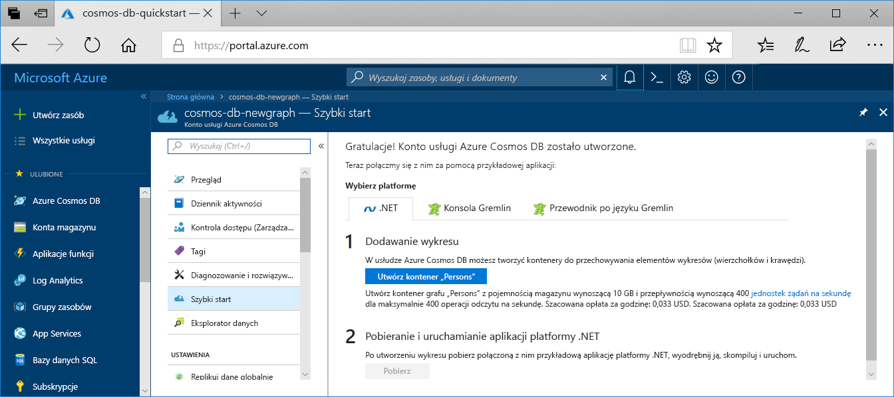

1. W nowym oknie przeglądarki zaloguj się do witryny [Azure Portal](https://portal.azure.com/).

2. Kliknij kolejno pozycje **Utwórz zasób** > **Bazy danych** > **Azure Cosmos DB**.
   
   

3. Na stronie **Tworzenie konta usługi Azure Cosmos DB** wprowadź ustawienia nowego konta usługi Azure Cosmos DB. 

    Ustawienie|Wartość|Opis
    ---|---|---
    Subskrypcja|Twoja subskrypcja|Wybierz subskrypcję platformy Azure, której chcesz użyć dla tego konta usługi Azure Cosmos DB. 
    Grupa zasobów|Tworzenie nowego elementu  Następnie wprowadź taką samą unikatową nazwę, która została podana jako identyfikator|Wybierz pozycję**Utwórz nowy**. Następnie wprowadź nazwę nowej grupy zasobów dla swojego konta. Dla uproszczenia użyj takiej samej nazwy jak identyfikator. 
    Nazwa konta|Wprowadź unikatową nazwę|Wprowadź unikatową nazwę do identyfikacji konta usługi Azure Cosmos DB. Ponieważ adres *documents.azure.com* jest dołączany do podanego identyfikatora w celu utworzenia identyfikatora URI, użyj unikatowego identyfikatora.  Identyfikator może zawierać tylko małe litery, cyfry i znaki łącznika (-). Musi mieć długość od 3 do 31 znaków.
    Interfejs API|Gremlin (wykres)|Interfejs API określa typ konta do utworzenia. Usługa Azure Cosmos DB oferuje pięć interfejsów API: Core(SQL) dla baz danych dokumentów, Gremlin dla baz danych wykresów, MongoDB dla baz danych dokumentów, Azure Table i Cassandra. Obecnie dla każdego interfejsu API należy utworzyć oddzielne konto.   Wybierz pozycję **Gremlin (graf)**, ponieważ w podręczniku Szybki start tworzysz tabelę, która współdziała z interfejsem API języka Gremlin.   [Dowiedz się więcej o interfejsie API programu Graph](../articles/cosmos-db/graph-introduction.md).|
    Lokalizacja|Wybierz region najbliżej Twoich użytkowników|Wybierz lokalizację geograficzną, w której będzie hostowane konto usługi Azure Cosmos DB. Użyj lokalizacji znajdującej się najbliżej Twoich użytkowników, aby zapewnić im najszybszy dostęp do danych.

    Wybierz pozycję **Przeglądanie+tworzenie**. Możesz pominąć sekcje **Sieć** i **Tagi**. 

    

4. Tworzenie konta potrwa kilka minut. Poczekaj, aż w portalu zostanie wyświetlona strona **Gratulacje! Konto usługi Azure Cosmos DB zostało utworzone**.

    