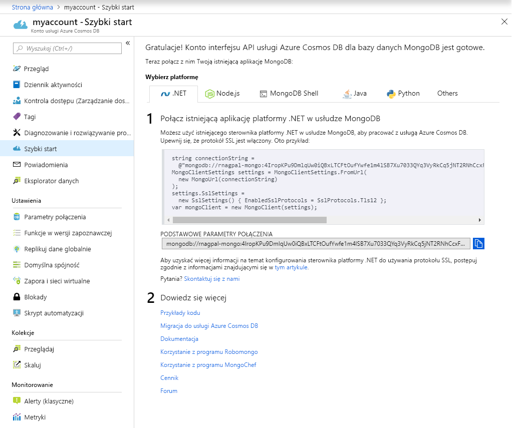

1. W nowym oknie zaloguj się do witryny [Azure Portal](https://portal.azure.com/).
2. W menu po lewej stronie wybierz pozycję **Utwórz zasób**, wybierz pozycję **bazy danych**, a następnie w obszarze **Azure Cosmos DB**wybierz pozycję **Utwórz**.
   
   

3. Na stronie **Tworzenie konta usługi Azure Cosmos DB** wprowadź ustawienia nowego konta usługi Azure Cosmos DB. 
 
    Ustawienie|Wartość|Opis
    ---|---|---
    Subskrypcja|Twoja subskrypcja|Wybierz subskrypcję platformy Azure, której chcesz użyć dla tego konta usługi Azure Cosmos DB. 
    Grupa zasobów|Tworzenie nowego elementu  Następnie wprowadź taką samą unikatową nazwę, która została podana jako identyfikator|Wybierz pozycję**Utwórz nowy**. Następnie wprowadź nazwę nowej grupy zasobów dla swojego konta. Dla uproszczenia użyj takiej samej nazwy jak identyfikator. 
    Nazwa konta|Wprowadź unikatową nazwę|Wprowadź unikatową nazwę do identyfikacji konta usługi Azure Cosmos DB. Ponieważ *Mongo.Cosmos.Azure.com* jest dołączany do identyfikatora, który podano w celu utworzenia identyfikatora URI, użyj unikatowego identyfikatora.  Identyfikator może zawierać tylko małe litery, cyfry i znaki łącznika (-). Musi mieć długość od 3 do 31 znaków.
    API|Interfejs API usługi Azure Cosmos DB dla bazy danych MongoDB|Interfejs API określa typ konta do utworzenia. Azure Cosmos DB oferuje pięć interfejsów API: Core (SQL) dla baz danych dokumentów, Gremlin dla baz danych programu Graph, Azure Cosmos DB interfejsu API MongoDB dla baz danych dokumentów, Azure Table i Cassandra. Obecnie dla każdego interfejsu API należy utworzyć oddzielne konto.   Wybierz pozycję **MongoDB** , ponieważ w tym przewodniku szybki start tworzysz kolekcję, która współpracuje z MongoDB.|
    Lokalizacja|Wybierz region najbliżej Twoich użytkowników|Wybierz lokalizację geograficzną, w której będzie hostowane konto usługi Azure Cosmos DB. Użyj lokalizacji znajdującej się najbliżej Twoich użytkowników, aby zapewnić im najszybszy dostęp do danych.
    Wersja|3.6|Wybierz pozycję MongoDB Wire Protocol w wersji 3,6 lub w celu zapewnienia zgodności z poprzednimi wersjami, a następnie wybierz pozycję 3,2.

    Wybierz pozycję **Przeglądanie+tworzenie**. Możesz pominąć sekcje **Sieć** i **Tagi**. 

    

4. Tworzenie konta potrwa kilka minut. Poczekaj, aż Portal wyświetli **gratulacje! Twoje konto usługi Cosmos z funkcją zgodności protokołu telekomunikacyjnych dla MongoDB jest gotowe** .

    
