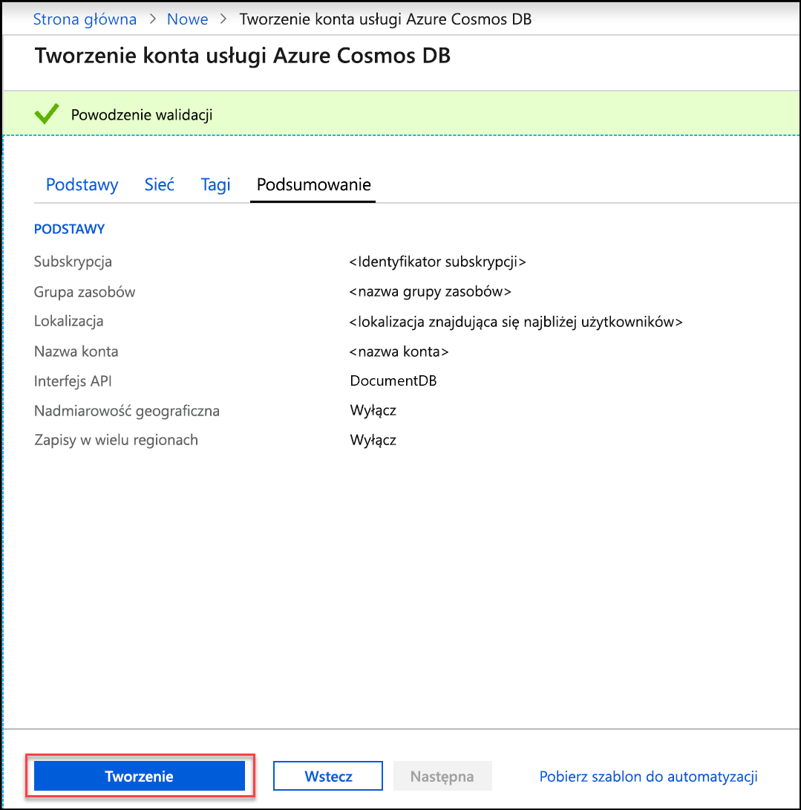
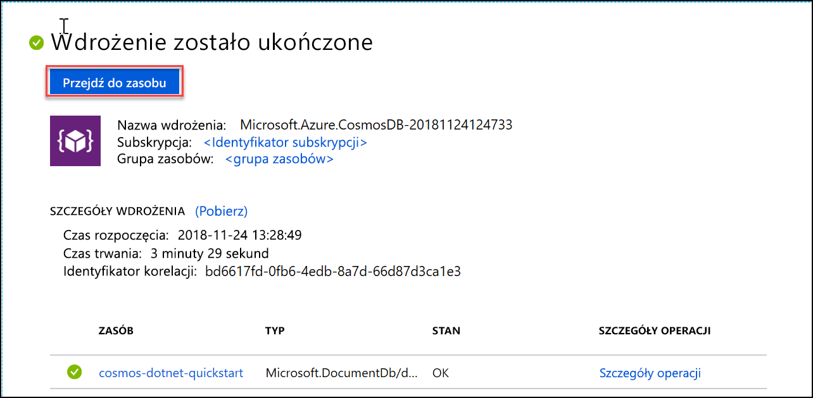

1. W nowym oknie przeglądarki zaloguj się do witryny [Azure Portal](https://portal.azure.com/).
2. Kliknij kolejno pozycje **Utwórz zasób** > **Bazy danych** > **Azure Cosmos DB**.
   
   

3. Na stronie **Tworzenie konta usługi Azure Cosmos DB** wprowadź ustawienia nowego konta usługi Azure Cosmos DB. 
 
    Ustawienie|Wartość|Opis
    ---|---|---
    Subskrypcja|*Twoja subskrypcja*|Wybierz subskrypcję platformy Azure, której chcesz użyć dla tego konta usługi Azure Cosmos DB. 
    Grupa zasobów|Tworzenie nowego elementu  *Wprowadź unikatową nazwę*|Wybierz pozycję **Utwórz nową**, a następnie wprowadź nazwę nowej grupy zasobów dla konta. Dla uproszczenia można użyć takiej samej nazwy nazwa konta. 
    Nazwa konta|*Wprowadź unikatową nazwę*|Wprowadź unikatową nazwę do identyfikacji konta usługi Azure Cosmos DB. Ponieważ adres *documents.azure.com* jest dołączany do podanego identyfikatora w celu utworzenia identyfikatora URI, użyj unikatowego identyfikatora.  Identyfikator może zawierać tylko małe litery, cyfry i znaki łącznika (-) oraz musi mieć długość od 3 do 31 znaków.
    Interfejs API|Core (SQL)|Interfejs API określa typ konta do utworzenia. Usługa Azure Cosmos DB oferuje pięć interfejsów API: SQL (baza danych dokumentów), Gremlin (baza danych wykresów), MongoDB (baza danych dokumentów), interfejs API tabel i interfejs API Cassandra. Każdy interfejs API obecnie wymaga utworzenia oddzielnego konta.   Wybierz pozycję **Core (SQL)**, ponieważ w tym artykule utworzysz bazę danych dokumentów i wykonasz zapytanie przy użyciu składni języka SQL.   [Dowiedz się więcej o interfejsie API SQL](../articles/cosmos-db/documentdb-introduction.md)|
    Lokalizacja|*Wybierz region najbliżej Twoich użytkowników*|Wybierz lokalizację geograficzną, w której będzie hostowane konto usługi Azure Cosmos DB. Użyj lokalizacji znajdującej się najbliżej Twoich użytkowników, aby zapewnić im najszybszy dostęp do danych.
    Włącz nadmiarowość geograficzną| Pozostaw puste | Spowoduje to utworzenie replikowanej wersji bazy danych w drugim (sparowanym) regionie. Pozostaw to pole puste.  
    Zapisy w wielu regionach| Pozostaw puste | Dzięki temu każdy z regionów baz danych może być zarówno regionem odczytu, jak i regionem zapisu. Pozostaw to pole puste.  

    Następnie kliknij pozycję **Przeglądanie + tworzenie**. Możesz pominąć sekcje **Sieć** i **Tagi**. 

    

    Przejrzyj informacje podsumowujące i kliknij pozycję **Utwórz**. 

    

4. Tworzenie konta potrwa kilka minut. Poczekaj, aż w portalu zostanie wyświetlony komunikat **Wdrożenie zostało ukończone**, a następnie kliknij pozycję **Przejdź do zasobu**.     

    

5. W portalu zostanie teraz wyświetlona strona**Gratulacje! Konto usługi Azure Cosmos DB zostało utworzone**.

    

