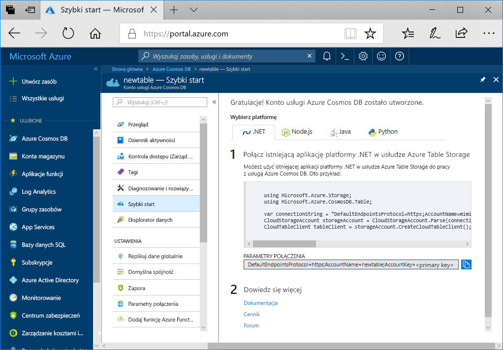

1. W nowym oknie przeglądarki zaloguj się do witryny [Azure Portal](https://portal.azure.com/).
2. W okienku nawigacji po lewej stronie wybierz **Utwórz zasób**. Wybierz **baz danych** , a następnie wybierz **usługi Azure Cosmos DB**.
   
   

3. Na **Tworzenie konta usługi Azure Cosmos DB** strony, wprowadź ustawienia dla nowego konta usługi Azure Cosmos DB:
 
    Ustawienie|Wartość|Opis
    ---|---|---
    Subskrypcja|Twoja subskrypcja|Wybierz subskrypcję platformy Azure, której chcesz użyć dla tego konta usługi Azure Cosmos DB. 
    Grupa zasobów|Tworzenie nowego elementu  Następnie wprowadź taką samą unikatową nazwę, która została podana jako identyfikator|Wybierz pozycję**Utwórz nowy**. Następnie wprowadź nazwę nowej grupy zasobów dla swojego konta. Dla uproszczenia użyj takiej samej nazwy jak identyfikator. 
    Nazwa konta|Wprowadź unikatową nazwę|Wprowadź unikatową nazwę do identyfikacji konta usługi Azure Cosmos DB.  Identyfikator może zawierać tylko małe litery, cyfry i znaki łącznika (-). Należy się od 3 do 31 znaków.
    Interfejs API|Tabela platformy Azure|Interfejs API określa typ konta do utworzenia. Usługa Azure Cosmos DB oferuje pięć interfejsów API: Core(SQL) dla baz danych dokumentów, Gremlin dla baz danych wykresów, MongoDB dla baz danych dokumentów, Azure Table i Cassandra. Obecnie dla każdego interfejsu API należy utworzyć oddzielne konto.   Wybierz **Azure Table** ponieważ w tym przewodniku Szybki Start tworzysz tabelę, która współdziała z interfejsem API tabel.   [Dowiedz się więcej na temat interfejsu API tabel](../articles/cosmos-db/table-introduction.md).|
    Lokalizacja|Wybierz region najbliżej Twoich użytkowników|Wybierz lokalizację geograficzną, w której będzie hostowane konto usługi Azure Cosmos DB. Użyj lokalizacji, która jest najbliżej Twoich użytkowników, aby zapewnić im najszybszy dostęp do danych.

    Możesz pozostawić **nadmiarowość geograficzna** i **zapisuje w wielu regionach** opcje wartościami domyślnymi (**wyłączyć**) aby uniknąć dodatkowych opłat jednostek RU. Możesz pominąć **sieci** i **tagi** sekcje.

5. Wybierz pozycję **Przeglądanie+tworzenie**. Po zakończeniu walidacji wybierz **Utwórz** do utworzenia konta. 
 
   

6. Trwa kilka minut, aby utworzyć konto. Zobaczysz komunikat informujący, **wdrożenia jest w toku**. Poczekaj, aż wdrożenia zakończyć, a następnie wybierz **przejdź do zasobu**.

    
