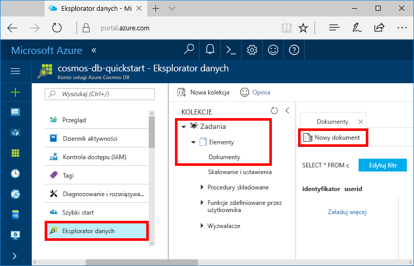

Teraz można dodać dane do nowej kolekcji za pomocą Eksploratora danych.

1. W Eksploratorze danych nowa baza danych jest wyświetlana w okienku Kolekcje. Rozwiń bazę danych **Tasks**, rozwiń kolekcję **Items**, kliknij pozycję **Dokumenty**, a następnie kliknij pozycję **Nowe dokumenty**. 

   
  
2. Teraz dodaj do kolekcji dokument o następującej strukturze.

     ```json
     {
         "id": "1",
         "category": "personal",
         "name": "groceries",
         "description": "Pick up apples and strawberries.",
         "isComplete": false
     }
     ```

3. Po dodaniu danych json do karty **Dokumenty** kliknij pozycję **Zapisz**.

    

4.  Utwórz i zapisz jeszcze jeden dokument, w którym wstawisz unikatową wartość dla właściwości `id` i zmienisz inne właściwości wedle uznania. Nowe dokumenty mogą mieć dowolną strukturę, ponieważ usługa Azure Cosmos DB nie wymusza żadnego schematu danych.