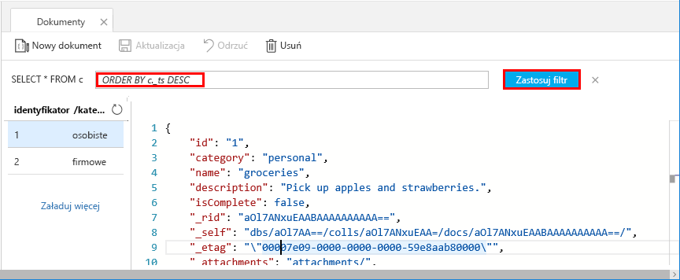

Za pomocą kwerend w Eksploratorze danych można pobierać i filtrować dane.

1. U góry karty **Elementy** w Eksploratorze `SELECT * FROM c`danych przejrzyj kwerendę domyślną . Ta kwerenda pobiera i wyświetla wszystkie dokumenty w kolekcji w kolejności identyfikatora. 
   
   
   
1. Aby zmienić kwerendę, wybierz pozycję Edytuj `ORDER BY c._ts DESC` **filtr,** zastąp kwerendę domyślną , a następnie wybierz pozycję Zastosuj **filtr**.
   
   

   Zmodyfikowana kwerenda wyświetla dokumenty w kolejności malejącej na podstawie ich sygnatury czasowej, więc teraz drugi dokument jest wyświetlany jako pierwszy. 
   
   

Jeśli znasz składnię SQL, możesz wprowadzić wszystkie obsługiwane [kwerendy SQL](../articles/cosmos-db/sql-api-sql-query.md) w polu predykatu kwerendy. Za pomocą Eksploratora danych można również tworzyć procedury przechowywane, pliki UDF i wyzwalacze dla logiki biznesowej po stronie serwera. 

Eksplorator danych zapewnia łatwy dostęp do witryny Azure portal do wszystkich wbudowanych funkcji dostępu do danych programowych dostępnych w interfejsach API. Portal służy również do skalowania przepływności, uzyskania kluczy i ciągów połączeń oraz przeglądania metryk i SLA dla konta usługi Azure Cosmos DB. 

