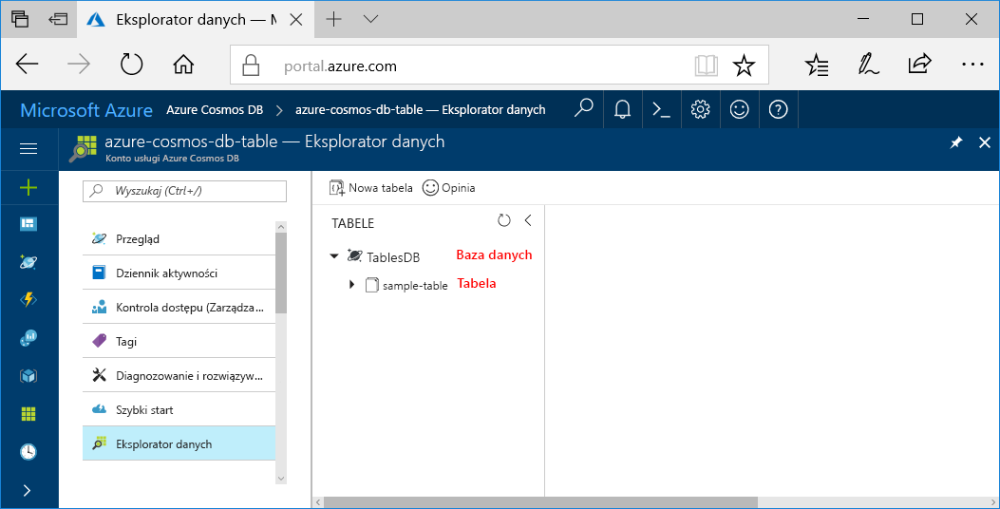

Teraz możesz użyć narzędzia Eksplorator danych w witrynie Azure Portal, aby utworzyć bazę danych i tabelę. 

1. Kliknij pozycję **Eksplorator danych** > **Nowa tabela**. 
    
    Obszar **Dodaj tabelę** zostanie wyświetlony po prawej stronie. Aby go zobaczyć, być może trzeba będzie przewinąć w prawo.

    

2. Na stronie **Dodawanie tabeli** wprowadź ustawienia dla nowej tabeli.

    Ustawienie|Sugerowana wartość|Opis
    ---|---|---
    Identyfikator tabeli|sample-table|Identyfikator nowej tabeli. W przypadku nazw tabel obowiązują takie same wymagania dotyczące znaków, jak dla identyfikatorów baz danych. Nazwy baz danych muszą zawierać od 1 do 255 znaków i nie mogą zawierać znaków `/ \ # ?` ani mieć spacji na końcu.
    Przepływność|400 jednostek żądania|Zmień przepływność na 400 jednostek żądania na sekundę (RU/s). Jeśli chcesz zmniejszyć opóźnienie, możesz później przeskalować przepływność w górę.

3. Kliknij przycisk **OK**.

4. W Eksploratorze danych zostanie wyświetlona nowa baza danych i tabela.

   