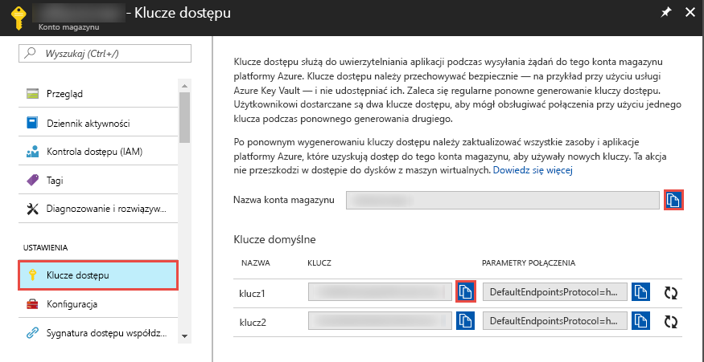

## <a name="prerequisites"></a>Wymagania wstępne

### <a name="azure-subscription"></a>Subskrypcja platformy Azure
Jeśli nie masz subskrypcji platformy Azure, przed rozpoczęciem utwórz [bezpłatne konto](https://azure.microsoft.com/free/).

### <a name="azure-roles"></a>Role platformy Azure
Aby utworzyć wystąpienia usługi Data Factory, konto użytkownika używane do logowania się na platformie Azure musi być członkiem roli *współautora* lub *właściciela* albo *administratorem* subskrypcji platformy Azure. W witrynie Azure Portal wybierz swoją nazwę użytkownika w prawym górnym rogu, a następnie wybierz pozycję **Uprawnienia**, aby wyświetlić uprawnienia, które masz w subskrypcji. Jeśli masz dostęp do wielu subskrypcji, wybierz odpowiednią subskrypcję. 

Aby utworzyć zasoby podrzędne — w tym zestawy danych, połączone usługi, potoki, wyzwalacze i środowiska Integration Runtime — oraz nimi zarządzać w usłudze Data Factory, należy spełnić następujące wymagania:
- Aby utworzyć zasoby podrzędne i nimi zarządzać, trzeba należeć do roli **Współautor w usłudze Data Factory** na poziomie grupy zasobów lub wyższej.
- W przypadku tworzenia zasobów podrzędnych i zarządzania nimi za pomocą programu PowerShell lub zestawu SDK rola **współautora** na poziomie grupy zasobów lub wyższej jest wystarczająca.

Aby uzyskać przykładowe instrukcje dotyczące dodawania użytkownika do roli, zobacz artykuł [Add roles (Dodawanie ról)](../articles/billing/billing-add-change-azure-subscription-administrator.md).

Aby uzyskać więcej informacji, zobacz następujące artykuły:
- [Data Factory Contributor role (Rola współautora w usłudze Data Factory)](../articles/role-based-access-control/built-in-roles.md#data-factory-contributor)
- [Roles and permissions for Azure Data Factory (Role i uprawnienia w usłudze Data Factory)](../articles/data-factory/concepts-roles-permissions.md)

### <a name="azure-storage-account"></a>Konto magazynu Azure
W tym samouczku Szybki start używasz konta usługi Azure Storage ogólnego przeznaczenia (w szczególności usługi Blob Storage) jako *źródłowego* i *docelowego* magazynu danych. Jeśli nie masz konta usługi Azure Storage ogólnego przeznaczenia, zobacz [Tworzenie konta magazynu](../articles/storage/common/storage-quickstart-create-account.md), aby uzyskać informacje o jego tworzeniu. 

#### <a name="get-the-storage-account-name-and-account-key"></a>Pobieranie nazwy konta i klucza konta magazynu
W tym przewodniku Szybki start będzie potrzebna nazwa i klucz konta usługi Azure Storage. Poniższa procedura służy do pobierania nazwy i klucza konta magazynu: 

1. Otwórz witrynę [Azure Portal](https://portal.azure.com) w przeglądarce internetowej. Zaloguj się przy użyciu nazwy użytkownika i hasła platformy Azure. 
2. Wybierz pozycję **Wszystkie usługi** w menu po lewej stronie, odfiltruj listę przy użyciu słowa kluczowego **Storage** i wybierz pozycję **Konta usługi Storage**.

   
3. Na liście kont magazynu znajdź swoje konto magazynu, w razie potrzeby używając filtrowania, a następnie wybierz to konto. 
4. Na stronie **Konto magazynu** wybierz z menu polecenie **Klucze dostępu**.

   
5. Skopiuj wartości pól **Nazwa konta magazynu** i **klucz1** do schowka. Wklej je do Notatnika lub innego edytora i zapisz plik. Będziesz ich używać w dalszej części tego samouczka Szybki start.   

#### <a name="create-the-input-folder-and-files"></a>Tworzenie plików i folderu wejściowego
W tej sekcji utworzysz kontener obiektów blob o nazwie **adftutorial** w usłudze Azure Blob Storage. Następnie utworzysz folder o nazwie **input** w kontenerze i przekażesz przykładowy plik do folderu input. 

1. Na stronie **Konto magazynu** przełącz się do widoku **Przegląd**, a następnie wybierz pozycję **Obiekty blob**. 

   
2. Na stronie **Blob service** wybierz pozycję **+ Kontener** na pasku narzędzi. 

       
3. W oknie dialogowym **Nowy kontener** wprowadź jako nazwę **adftutorial**, a następnie wybierz przycisk **OK**. 

   
4. Wybierz pozycję **adftutorial** na liście kontenerów. 

   
5. Na stronie **Kontener** wybierz pozycję **Przekaż** na pasku narzędzi.  

   
6. Na stronie **Przekazywanie obiektu blob** wybierz pozycję **Zaawansowane**.

   
7. Uruchom **Notatnik** i utwórz plik o nazwie **emp.txt** z następującą zawartością. Zapisz go w folderze **c:\ADFv2QuickStartPSH**. Utwórz folder **ADFv2QuickStartPSH**, jeśli jeszcze nie istnieje.
    
   ```
   John, Doe
   Jane, Doe
   ```    
8. W witrynie Azure Portal na stronie **Przekazywanie obiektu blob** wyszukaj i wybierz plik **emp.txt** w polu **Pliki**. 
9. Wprowadź **input** jako wartość pola **Przekaż do folderu**. 

        
10. Upewnij się, że wybrano folder **input** i plik **emp.txt**, a następnie wybierz przycisk **Przekaż**.
    
    Na liście powinien pojawić się plik **emp.txt** i stan przekazywania. 
12. Zamknij stronę **Przekazywanie obiektu blob**, klikając przycisk **X** w rogu strony. 

    
1. Nie zamykaj strony **Kontener**. Będzie ona używana do weryfikowania danych wyjściowych na końcu tego samouczka Szybki start.