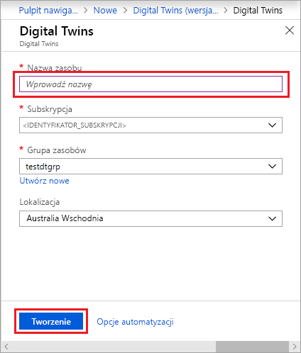

1. Zaloguj się w witrynie [Azure Portal](http://portal.azure.com).

1. W okienku po lewej stronie wybierz pozycję **Utwórz zasób**. Wyszukaj pozycję **digital twins** i wybierz pozycję **Digital Twins (wersja zapoznawcza)**. Wybierz przycisk **Utwórz**, aby rozpocząć proces wdrażania.

   

1. W okienku **Digital Twins** wprowadź następujące informacje:
   * **Nazwa zasobu**: utwórz unikatową nazwę dla wystąpienia usługi Digital Twins.
   * **Subskrypcja**: wybierz subskrypcję, która ma zostać użyta do utworzenia tego wystąpienia usługi Digital Twins. 
   * **Grupa zasobów**: wybierz lub utwórz [grupę zasobów](https://docs.microsoft.com/azure/azure-resource-manager/resource-group-overview#resource-groups) dla wystąpienia usługi Digital Twins.
   * **Lokalizacja**: wybierz lokalizację znajdującą się najbliżej Twoich urządzeń.

    

1. Przejrzyj informacje dotyczące usługi Digital Twins, a następnie wybierz pozycję **Utwórz**. Tworzenie wystąpienia usługi Digital Twins może potrwać kilka minut. Postępy możesz monitorować w okienku **Powiadomienia**.

1. Otwórz okienko **Przegląd** wystąpienia usługi Digital Twins. Zwróć uwagę na link w obszarze **Interfejs API zarządzania**.

   Adres URL **interfejsu API zarządzania** ma następujący format: _https://yourDigitalTwinsName.yourLocation.azuresmartspaces.net/management/swagger_. Ten adres URL prowadzi do dokumentacji interfejsu API REST usługi Azure Digital Twins dotyczącej Twojego wystąpienia. Przeczytaj artykuł [Jak używać struktury Swagger w usłudze Digital Twins](../articles/digital-twins/how-to-use-swagger.md), aby dowiedzieć się, jak odczytać tę dokumentację interfejsu API i korzystać z niej.

    Zmodyfikuj adres URL **interfejsu API zarządzania** do następującego formatu: _https://yourDigitalTwinsName.yourLocation.azuresmartspaces.net/management/api/v1.0/_. Aplikacja uzyska dostęp do Twojego wystąpienia, używając zmodyfikowanego adresu URL jako podstawowego adresu URL. Skopiuj ten zmodyfikowany adres URL do pliku tymczasowego. Będzie potrzebny w następnej sekcji.

    