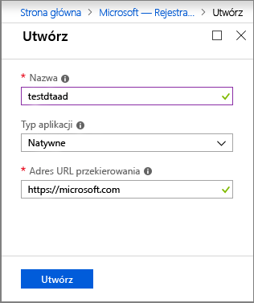

>[!NOTE]
>Ta sekcja zawiera instrukcje dotyczące [rejestracji aplikacji usługi Azure AD](https://docs.microsoft.com/azure/active-directory/develop/quickstart-register-app).

1. W [Azure Portal](https://portal.azure.com)Otwórz **Azure Active Directory** z menu rozwijanego po lewej stronie, a następnie otwórz okienko **rejestracje aplikacji** . 

    

1. Wybierz przycisk **+ Nowa rejestracja** .

    

1. Wprowadź przyjazną nazwę tej rejestracji aplikacji w polu **Nazwa**. W sekcji **Identyfikator URI przekierowania (opcjonalnie)** wybierz pozycję **Klient publiczny/natywny (Mobile & Desktop)** z menu rozwijanego po lewej stronie, a następnie wprowadź `https://microsoft.com` w polu tekstowym po prawej stronie. Wybierz pozycję **Zarejestruj**.

    

1. Aby upewnić się, że [aplikacja jest zarejestrowana jako **Klient publiczny**](https://docs.microsoft.com/azure/active-directory/develop/scenario-desktop-app-registration), Otwórz okienko **uwierzytelnianie** dla rejestracji aplikacji i przewiń w dół w tym okienku. W sekcji **domyślny typ klienta** wybierz pozycję **tak** dla **aplikacji Traktuj jako klient publiczny**i naciśnij przycisk **Zapisz**.

    Sprawdź **tokeny dostępu** , aby włączyć ustawienie **Oauth2AllowImplicitFlow** w pliku manifest. JSON.

    

1.  Otwórz okienko **Przegląd** zarejestrowanej aplikacji i skopiuj wartości następujących jednostek do pliku tymczasowego. Te wartości będą używane do konfigurowania przykładowej aplikacji w poniższych sekcjach.

    - **Identyfikator aplikacji (klienta)**
    - **Identyfikator katalogu (dzierżawcy)**

    [Identyfikator aplikacji Azure Active Directory ](./media/digital-twins-permissions/aad-app-reg-app-id.png#lightbox)

1. Otwórz okienko **uprawnień interfejsu API** dla rejestracji aplikacji. Wybierz pozycję **+ Dodaj przycisk uprawnienia** . W okienku **uprawnienia żądania interfejsu API** wybierz opcję **interfejsy API Moja organizacja używa** karty, a następnie wyszukaj jedną z następujących opcji:
    
    1. `Azure Digital Twins`. Wybierz interfejs API **Digital bliźniaczych reprezentacji platformy Azure** .

        [Interfejs API wyszukiwania ](./media/digital-twins-permissions/aad-aap-search-api-dt.png#lightbox)

    1. Możesz też wyszukać `Azure Smart Spaces Service`. Wybierz interfejs API **usługi Azure Smart Spaces** .

        [Interfejs API wyszukiwania ](./media/digital-twins-permissions/aad-app-search-api.png#lightbox)

    > [!IMPORTANT]
    > Nazwa i identyfikator interfejsu API usługi Azure AD, który będzie wyświetlany, zależy od dzierżawcy:
    > * Przeszukaj `Azure Digital Twins`.
    > * Inne konta Microsoft powinny szukać `Azure Smart Spaces Service`.

1. Jeden z interfejsów API będzie wyświetlany jako **usługa Azure Digital bliźniaczych reprezentacji** w tym samym okienku **uprawnień interfejsu API żądania** . Wybierz opcję **Odczyt Odczytaj** , a następnie zaznacz pole wyboru **Odczyt. zapis** . Wybierz przycisk **Dodaj uprawnienia** .

    

1. W zależności od ustawień organizacji może być konieczne wykonanie dodatkowych czynności w celu udzielenia administratorowi dostępu do tego interfejsu API. Aby uzyskać więcej informacji, skontaktuj się z administratorem. Po zatwierdzeniu dostępu administratora do kolumny **wymagana jest zgoda administratora** w okienku **uprawnienia interfejsu API** zostaną wyświetlone Twoje uprawnienia. 

    

    Sprawdź, czy zostanie wyświetlona **Usługa Digital bliźniaczych reprezentacji** .
