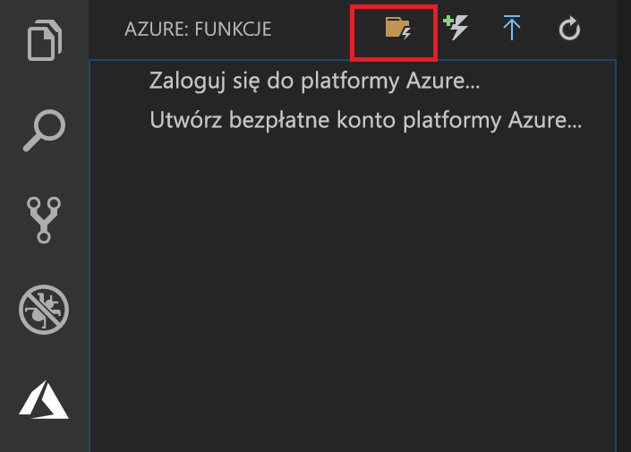

## Tworzenie projektu usługi Azure Functions

Szablon projektu usługi Azure Functions w programie Visual Studio Code umożliwia utworzenie projektu, który można opublikować w aplikacji funkcji na platformie Azure. Aplikacja funkcji umożliwia grupowanie funkcji w jednostki logiczne, co ułatwia wdrażanie i udostępnianie zasobów oraz zarządzanie nimi.

1. W programie Visual Studio Code Wybierz logo platformy Azure, aby wyświetlić **platformy Azure: Funkcje** obszaru, a następnie wybierz ikonę Utwórz nowy projekt.

    

1. Wybierz lokalizację dla obszaru roboczego projektu, a następnie wybierz pozycję **Select** (Wybierz).

    > [!NOTE]
    > Ten artykuł został zaprojektowany pod kątem wykonania poza obszarem roboczym. W takim przypadku nie wybieraj folderu projektu, który jest częścią obszaru roboczego.

1. Wybierz język dla projektu aplikacji funkcji. W tym artykule użyto języka JavaScript.
    

1. Po wyświetleniu monitu wybierz pozycję **Add to workspace** (Dodaj do obszaru roboczego).

Program Visual Studio Code utworzy projekt aplikacji funkcji w nowym obszarze roboczym. Ten projekt zawiera pliki konfiguracyjne [host.json](../articles/azure-functions/functions-host-json.md) i [local.settings.json](../articles/azure-functions/functions-run-local.md#local-settings-file), a także wszystkie specyficzne dla języka pliki projektu. W folderze projektu może się także znaleźć nowe repozytorium Git.