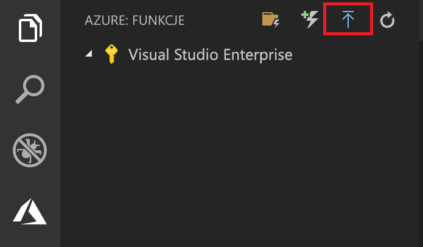

## Publikowanie projektu na platformie Azure

W tej sekcji utworzysz aplikację funkcji i powiązane zasoby w ramach subskrypcji platformy Azure, a następnie wdrożono swój kod.

> [!IMPORTANT]
> Publikowanie do istniejącej aplikacji funkcji spowoduje zastąpienie zawartości tej aplikacji na platformie Azure.

1. Wybierz ikonę platformy Azure na pasku działania, a następnie w obszarze **Azure: Functions** wybierz przycisk **Wdróż do aplikacji funkcji...** .

    

1. Podaj następujące informacje na ekranie:

    - **Wybierz folder** : Wybierz folder z obszaru roboczego lub przejdź do folderu, który zawiera aplikację funkcji. Nie zobaczysz tego, jeśli masz już otwartą prawidłową aplikację funkcji.

    - **Wybierz subskrypcję** : wybierz subskrypcję do użycia. Nie zobaczysz tego, jeśli masz tylko jedną subskrypcję.

    - **Wybierz Aplikacja funkcji na platformie Azure** : wybierz opcję `- Create new Function App` . (Nie należy wybierać `Advanced` opcji, która nie jest objęta tym artykułem).
      
    - **Wprowadź globalnie unikatową nazwę aplikacji funkcji** : wpisz nazwę, która jest prawidłowa w ścieżce URL. Wpisana nazwa zostanie sprawdzona, aby upewnić się, że jest ona unikatowa w Azure Functions.
    
    - **Wybierz lokalizację dla nowych zasobów** : Aby uzyskać lepszą wydajność, wybierz [region](https://azure.microsoft.com/regions/) w sąsiedztwie. 
    
1.  Po zakończeniu następujące zasoby platformy Azure są tworzone w ramach subskrypcji przy użyciu nazw opartych na nazwie aplikacji funkcji:
    
    - Grupa zasobów, która jest kontenerem logicznym dla powiązanych zasobów.
    - Standardowe konto usługi Azure Storage, które zachowuje stan i inne informacje o projektach.
    - Plan zużycia, który definiuje podstawowego hosta dla aplikacji funkcji bezserwerowej. 
    - Aplikacja funkcji, która zapewnia środowisko do wykonywania kodu funkcji. Aplikacja funkcji umożliwia grupowanie funkcji jako jednostki logicznej, co ułatwia zarządzanie, wdrażanie i udostępnianie zasobów w ramach tego samego planu hostingu.
    - Wystąpienie Application Insights połączone z aplikacją funkcji, która śledzi użycie funkcji bezserwerowej.

    Po utworzeniu aplikacji funkcji i zastosowaniu pakietu wdrożeniowego zostanie wyświetlone powiadomienie. 
    
1. Wybierz pozycję **Wyświetl dane wyjściowe** w tym powiadomieniu, aby wyświetlić wyniki tworzenia i wdrażania, w tym utworzone zasoby platformy Azure. W przypadku odrzucenia powiadomienia wybierz ikonę dzwonka w prawym dolnym rogu, aby zobaczyć ją ponownie.

    
