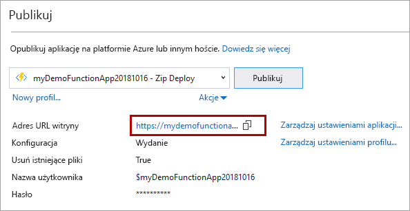

1. W **Eksploratorze rozwiązań** kliknij prawym przyciskiem myszy projekt i wybierz polecenie **Opublikuj**.

2. W oknie dialogowym **Wybieranie elementu docelowego publikowania** Użyj opcji publikowania zgodnie z opisem w tabeli poniżej obrazu: 

    

    | Opcja      | Opis                                |
    | ------------ |  -------------------------------------------------- |
    | **Azure Functions plan zużycia** |   Po opublikowaniu projektu w aplikacji funkcji, która jest uruchamiana w [planie zużycia](../articles/azure-functions/functions-scale.md#consumption-plan), płacisz tylko za wykonywanie aplikacji funkcji. Inne plany hostingu wiążą się z wyższymi kosztami. Aby dowiedzieć się więcej, zobacz [Azure Functions skalowanie i hosting](../articles/azure-functions/functions-scale.md). | 
    | **Utwórz nowy** | Nowa aplikacja funkcji z powiązanymi zasobami jest tworzona na platformie Azure. Po wybraniu pozycji **Wybierz istniejącą** wszystkie pliki w istniejącej aplikacji funkcji na platformie Azure zostaną zastąpione przez pliki z projektu lokalnego. Tej opcji należy używać tylko w przypadku ponownego publikowania aktualizacji do istniejącej aplikacji funkcji. |
    | **Uruchom z pliku pakietu** | Aplikacja funkcji jest wdrażana przy użyciu narzędzia [zip Deploy](../articles/azure-functions/functions-deployment-technologies.md#zip-deploy) z włączonym trybem [uruchamiania z pakietu](../articles/azure-functions/run-functions-from-deployment-package.md) . Jest to zalecany sposób uruchamiania funkcji, co zapewnia lepszą wydajność. Gdy nie korzystasz z tej opcji, pamiętaj, aby zatrzymać uruchamianie projektu aplikacji funkcji lokalnie przed opublikowaniem na platformie Azure. |

3. Wybierz pozycję **Publikuj**. Jeśli jeszcze nie zalogowano się na koncie platformy Azure z poziomu programu Visual Studio, wybierz pozycję **Zaloguj**. Możesz również utworzyć bezpłatne konto platformy Azure.

4. W oknie dialogowym **Azure App Service: Utwórz nowe** Użyj ustawień **hostingu** określonych w tabeli poniżej obrazu:

    

    | Ustawienie      | Sugerowana wartość  | Opis                                |
    | ------------ |  ------- | -------------------------------------------------- |
    | **Nazwa** | Nazwa unikatowa w skali globalnej | Unikatowa nazwa identyfikująca nową aplikację funkcji. Prawidłowe znaki to `a-z`, `0-9` i `-`. |
    | **Subskrypcja** | Wybierz subskrypcję | Subskrypcja platformy Azure, która ma być używana. |
    | **[Grupa zasobów](../articles/azure-resource-manager/resource-group-overview.md)** | myResourceGroup |  Nazwa grupy zasobów, w której ma zostać utworzona aplikacja funkcji. Wybierz pozycję **Nowa**, aby utworzyć nową grupę zasobów.|
    | **[Plan hostingu](../articles/azure-functions/functions-scale.md)** | Plan Zużycie | Pamiętaj o wybraniu **zużycia** w obszarze **rozmiar** po wybraniu pozycji **Nowy** , aby utworzyć plan bezserwerowy. Ponadto w polu **Lokalizacja** wybierz [region](https://azure.microsoft.com/regions/) w swojej okolicy lub w pobliżu innych usług, do których Twoje funkcje uzyskują dostęp. W razie działania w planie innym niż **Zużycie** konieczne jest zarządzanie [skalowaniem aplikacji funkcji](../articles/azure-functions/functions-scale.md).  |
    | **[Azure Storage](../articles/storage/common/storage-quickstart-create-account.md)** | Konto magazynu ogólnego przeznaczenia | Środowisko uruchomieniowe usługi Functions wymaga konta magazynu platformy Azure. Wybierz pozycję **Nowy** , aby utworzyć konto magazynu ogólnego przeznaczenia. Możesz również użyć istniejącego konta, które spełnia [wymagania dotyczące konta magazynu](../articles/azure-functions/functions-scale.md#storage-account-requirements).  |

5. Wybierz pozycję **Utwórz** , aby utworzyć aplikację funkcji i powiązane zasoby na platformie Azure z tymi ustawieniami i wdrożyć kod projektu funkcji. 

6. Po ukończeniu wdrażania zanotuj wartość **Adres URL witryny**, która jest adresem aplikacji funkcji na platformie Azure.

    
