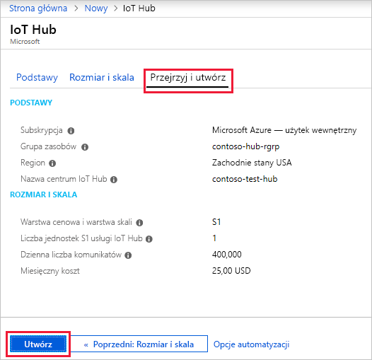

W tej sekcji opisano, jak utworzyć centrum IoT przy użyciu witryny [Azure Portal](https://portal.azure.com).

1. Zaloguj się do [Portalu Azure](https://portal.azure.com).

1. Na stronie głównej platformy Azure wybierz przycisk **+ Utwórz zasób,** a następnie wprowadź *Centrum IoT* w polu **Wyszukaj w portalu Marketplace.**

1. Wybierz **Centrum IoT z** wyników wyszukiwania, a następnie wybierz pozycję **Utwórz**.

1. Na karcie **Podstawy** wypełnij pola w następujący sposób:

   - **Subskrypcja**: wybierz subskrypcję, która ma być używana dla twojego centrum.

   - **Grupa zasobów**: Wybierz grupę zasobów lub utwórz nową. Aby utworzyć nową, wybierz **pozycję Utwórz nowy** i wprowadź nazwę, której chcesz użyć. Aby użyć istniejącej grupy zasobów, wybierz tę grupę zasobów. Aby uzyskać więcej informacji, zobacz [Zarządzanie grupami zasobów usługi Azure Resource Manager](../articles/azure-resource-manager/management/manage-resource-groups-portal.md).

   - **Region:** Wybierz region, w którym ma się znajdować koncentrator. Wybierz lokalizację najbliższą. Niektóre funkcje, takie jak [strumienie urządzeń usługi IoT Hub,](../articles/iot-hub/iot-hub-device-streams-overview.md)są dostępne tylko w określonych regionach. W przypadku tych ograniczonych funkcji należy wybrać jeden z obsługiwanych regionów.

   - **Nazwa centrum IoT:** Wprowadź nazwę centrum. Ta nazwa musi być unikatowa w skali globalnej. Jeśli wprowadzona nazwa jest dostępna, zostanie wyświetlony zielony znacznik wyboru.

   [!INCLUDE [iot-hub-pii-note-naming-hub](iot-hub-pii-note-naming-hub.md)]

   

1. Wybierz **dalej: Rozmiar i skala,** aby kontynuować tworzenie koncentratora.

   

   Ustawienia domyślne można zaakceptować tutaj. W razie potrzeby można zmodyfikować dowolne z następujących pól: 

    - **Warstwa cen i skalowania:** wybrana warstwa. Możesz wybierać spośród kilku warstw, w zależności od tego, ile funkcji chcesz i ile wiadomości wysyłasz za pośrednictwem rozwiązania dziennie. Warstwa Bezpłatna służy do testowania i oceny. Umożliwia podłączenie 500 urządzeń do koncentratora i do 8000 wiadomości dziennie. Każda subskrypcja platformy Azure można utworzyć jeden centrum IoT w warstwie bezpłatnej. 

      Jeśli pracujesz za pośrednictwem strumieni urządzeń Usługi Szybki start dla usługi IoT Hub, wybierz warstwę bezpłatną.

    - **Jednostki centrum IoT**: liczba dozwolonych komunikatów na jednostkę dziennie zależy od warstwy cenowej centrum. Na przykład jeśli chcesz, aby centrum obsługiwać przychodzących 700 000 wiadomości, należy wybrać dwie jednostki warstwy S1.
    Aby uzyskać szczegółowe informacje na temat innych opcji warstw, zobacz [Choosing the right IoT Hub tier](../articles/iot-hub/iot-hub-scaling.md) (Wybieranie właściwej warstwy usługi IoT Hub).

    - **Usługa Azure Security Center:** Włącz tę usługę, aby dodać dodatkową warstwę ochrony przed zagrożeniami do IoT i urządzeń. Ta opcja nie jest dostępna dla koncentratorów w warstwie bezpłatnej. Aby uzyskać więcej informacji na temat tej funkcji, zobacz [Centrum zabezpieczeń platformy Azure dla IoT](https://docs.microsoft.com/azure/asc-for-iot/).

    - **Ustawienia zaawansowane** > **Device-to-cloud partycje:** Ta właściwość odnosi się do urządzenia do chmury wiadomości do liczby jednoczesnych czytników wiadomości. Większość koncentratorów potrzebuje tylko czterech partycji.

1.  Wybierz **dalej: Tagi,** aby przejść do następnego ekranu.

    Tagi to pary nazw i wartości. Ten sam znacznik można przypisać do wielu zasobów i grup zasobów, aby kategoryzować zasoby i konsolidować rozliczenia. Aby uzyskać więcej informacji, zobacz [Organizowanie zasobów platformy Azure za pomocą tagów.](../articles/azure-resource-manager/management/tag-resources.md)

    

1.  Wybierz **dalej: Przejrzyj + utwórz,** aby przejrzeć swoje wybory. Zobaczysz coś podobnego do tego ekranu, ale z wartościami wybranymi podczas tworzenia koncentratora. 

    

1.  Wybierz **pozycję Utwórz,** aby utworzyć nowe centrum. Utworzenie centrum zajmuje kilka minut.
