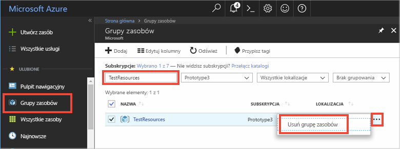

Jeśli zamierzasz przejść do kolejnego zalecanego artykułu, możesz zachować już utworzone zasoby i użyć ich ponownie.

W przeciwnym razie możesz usunąć zasoby platformy Azure utworzone w tym artykule, aby uniknąć naliczania opłat. 

> [!IMPORTANT]
> Usunięcie grupy zasobów jest nieodwracalne. Grupa zasobów oraz wszystkie zawarte w niej zasoby zostaną trwale usunięte. Uważaj, aby nie usunąć przypadkowo niewłaściwych zasobów lub grupy zasobów. Jeśli usługa IoT Hub została utworzona wewnątrz istniejącej grupy zasobów zawierającej zasoby, które chcesz zachować, zamiast usuwać całą grupę zasobów, usuń tylko zasób usługi IoT Hub.
>

Aby usunąć grupę zasobów na podstawie nazwy:

1. Zaloguj się do witryny [Azure Portal](https://portal.azure.com) i kliknij pozycję **Grupy zasobów**.

2. W polu tekstowym **Filtruj według nazwy** wpisz nazwę grupy zasobów zawierającej usługę IoT Hub. 

3. Z prawej strony grupy zasobów na liście wyników kliknij pozycję **...** , a następnie kliknij pozycję **Usuń grupę zasobów**.

    

4. Zobaczysz prośbę o potwierdzenie usunięcia grupy zasobów. Ponownie wpisz nazwę grupy zasobów w celu potwierdzenia, a następnie kliknij pozycję **Usuń**. Po krótkim czasie grupa zasobów i wszystkie zawarte w niej zasoby zostaną usunięte.