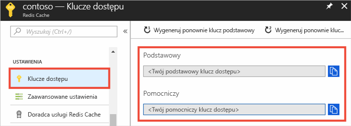

### Pobieranie nazwy hosta, portów i kluczy dostępu z Azure Portal

Aby nawiązać połączenie z usługą Azure cache for Redis, klienci pamięci podręcznej potrzebują nazwy hosta, portów i klucza dla pamięci podręcznej. Niektórzy klienci mogą odwoływać się do tych elementów przy użyciu nieco innych nazw. Możesz uzyskać nazwę hosta, porty i klucze z [Azure Portal](https://portal.azure.com).

- Aby uzyskać klucze dostępu, w obszarze nawigacji po lewej stronie wybierz pozycję **klucze dostępu**. 
  
  

- Aby uzyskać nazwę hosta i porty, z okienka nawigacji po lewej stronie wybierz pozycję **Właściwości**. Nazwa hosta ma postać * \<nazwa DNS>. Redis.cache.Windows.NET*.

  

