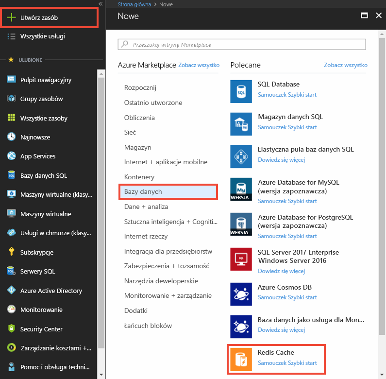

1. Aby utworzyć pamięć podręczną, zaloguj się do [Azure Portal](https://portal.azure.com) i wybierz pozycję **Utwórz zasób**. 
   
   
   
1. Na stronie **Nowy** wybierz pozycję **bazy danych** , a następnie wybierz pozycję **Azure cache for Redis**.
   
   
   
1. Na stronie **nowy Redis Cache** Skonfiguruj ustawienia dla nowej pamięci podręcznej.
   
   | Ustawienie      | Sugerowana wartość  | Opis |
   | ------------ |  ------- | -------------------------------------------------- |
   | **Nazwa DNS** | Podaj globalnie unikatową nazwę. | Nazwa pamięci podręcznej musi być ciągiem z przedziału od 1 do 63 znaków, który zawiera tylko cyfry, litery lub łączniki. Nazwa musi zaczynać się i kończyć cyfrą lub literą i nie może zawierać następujących po sobie łączników. *Nazwa hosta* wystąpienia pamięci podręcznej to * \<DNS name> . Redis.cache.Windows.NET*. | 
   | **Subskrypcja** | Lista rozwijana i wybierz swoją subskrypcję. | Subskrypcja, w ramach której ma zostać utworzone nowe wystąpienie usługi Azure cache for Redis. | 
   | **Grupa zasobów** | Rozwiń i wybierz grupę zasobów lub wybierz pozycję **Utwórz nową** , a następnie wprowadź nową nazwę grupy zasobów. | Nazwa grupy zasobów, w której ma zostać utworzona pamięć podręczna i inne zasoby. Umieszczenie wszystkich zasobów aplikacji w jednej grupie zasobów pozwala łatwo zarządzać nimi i usuwać je razem. | 
   | **Lokalizacja** | Lista rozwijana i wybierz lokalizację. | Wybierz [region](https://azure.microsoft.com/regions/) blisko innych usług, które będą korzystać z pamięci podręcznej. |
   | **Warstwa cenowa** | Lista rozwijana i wybierz [warstwę cenową](https://azure.microsoft.com/pricing/details/cache/). |  Warstwa cenowa decyduje o rozmiarze, wydajności i funkcjach dostępnych dla pamięci podręcznej. Aby uzyskać więcej informacji, zobacz [Omówienie pamięci podręcznej Azure Cache for Redis](../articles/azure-cache-for-redis/cache-overview.md). |
   
1. Wybierz przycisk **Utwórz**. 
   
    
   
   > [!NOTE]
   > Możesz oczekiwać, że inicjowanie obsługi pamięci podręcznej zajmie około 15 do 20 minut.   
   
   Postęp można monitorować na stronie **Przegląd** usługi Azure cache for Redis. Gdy **stan** jest wyświetlany jako **uruchomiony**, pamięć podręczna jest gotowa do użycia.
   
   

