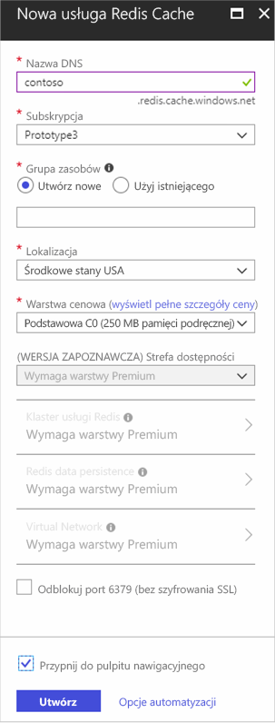

Aby utworzyć pamięć podręczną, najpierw zaloguj się w [witrynie Azure Portal](https://portal.azure.com), a następnie kliknij kolejno opcje **Nowe**, **Dane i magazyn**, **Pamięć podręczna Redis**.

> [!NOTE]
> Jeśli nie masz konta Azure, możesz w ciągu kliku minut [utworzyć je bezpłatnie](https://azure.microsoft.com/pricing/free-trial/?WT.mc_id=redis_cache_hero).
> 
> 

> [!NOTE]
> Oprócz tworzenia pamięci podręcznych w witrynie Azure Portal, możesz również utworzyć je przy użyciu programu PowerShell, interfejsu wiersza polecenia platformy Azure oraz szablonów usługi Resource Manager.
> 
> * Informacje na temat tworzenia pamięci podręcznej za pomocą szablonów usługi Resource Manager można znaleźć w temacie [Create a Redis cache using a template](../articles/redis-cache/cache-redis-cache-arm-provision.md) (Tworzenie pamięci podręcznej Redis przy użyciu szablonu).
> * Informacje na temat tworzenia pamięci podręcznej przy użyciu programu Azure PowerShell można znaleźć w temacie [Zarządzanie usługą Azure Redis Cache za pomocą programu Azure PowerShell](../articles/redis-cache/cache-howto-manage-redis-cache-powershell.md).
> * Informacje na temat tworzenia pamięci podręcznej za pomocą interfejsu wiersza polecenia platformy Azure można znaleźć w temacie [Tworzenie pamięci podręcznej w usłudze Premium Azure Redis Cache oraz zarządzanie nią za pomocą interfejsu wiersza polecenia platformy Azure (Azure CLI)](../articles/redis-cache/cache-manage-cli.md).
> 
> 

W bloku **Nowa pamięć podręczna Redis** określ odpowiednią konfigurację pamięci podręcznej.

 

* W polu **Nazwa DNS** wprowadź nazwę pamięci podręcznej, która zostanie użyta dla punktu końcowego pamięci podręcznej. Nazwa pamięci podręcznej musi być ciągiem od 1 do 63 znaków i może zawierać tylko cyfry, litery i znak `-`. Na początku ani na końcu nazwy pamięci podręcznej nie może występować znak `-`, a następujące po sobie znaki `-` nie są prawidłowe.
* W polu **Subskrypcja** wybierz subskrypcję platformy Azure, która ma być używana dla pamięci podręcznej. Jeśli konto ma tylko jedną subskrypcję, zostanie ona automatycznie wybrana i lista rozwijana **Subskrypcja** nie będzie wyświetlana.
* W polu **Grupa zasobów** wybierz lub utwórz grupę zasobów dla pamięci podręcznej. Więcej informacji można znaleźć w temacie [Używanie grup zasobów do zarządzania zasobami platformy Azure](../articles/resource-group-overview.md). 
* Użyj opcji **Lokalizacja**, aby określić lokalizację geograficzną, w której będzie hostowana pamięć podręczna. Firma Microsoft zdecydowanie zaleca tworzenie pamięci podręcznej w tym samym regionie, w którym występuje aplikacja klienta pamięci podręcznej, w celu uzyskania możliwie najlepszej wydajności.
* W polu **Warstwa cenowa** wybierz odpowiedni rozmiar i funkcje pamięci podręcznej.
* **Klaster Redis** umożliwia tworzenie pamięci podręcznych większych niż 53 GB i współdzielenie danych między wieloma węzłami Redis. Aby uzyskać więcej informacji, zobacz temat [Konfigurowanie usługi klastrowania dla usługi Azure Redis Cache w warstwie Premium](../articles/redis-cache/cache-how-to-premium-clustering.md).
* **Trwałość Redis** oferuje możliwość utrzymania pamięci podręcznej na koncie usługi Azure Storage. Instrukcje na temat konfigurowania trwałości można znaleźć w temacie [Konfigurowanie trwałości dla usługi Azure Redis Cache w warstwie Premium](../articles/redis-cache/cache-how-to-premium-persistence.md).
* **Sieć wirtualna** zapewnia większe bezpieczeństwo i izolację przez zezwolenie na dostęp do pamięci podręcznej tylko klientom w określonej sieci usługi Azure Virtual Network. Aby jeszcze bardziej ograniczyć dostęp do serwera Redis, można użyć wszystkich funkcji VNet, np. podsieci, zasad kontroli dostępu oraz innych funkcji. Więcej informacji można znaleźć w temacie [Konfigurowanie obsługi sieci wirtualnej dla usługi Azure Redis Cache w warstwie Premium](../articles/redis-cache/cache-how-to-premium-vnet.md).

Po skonfigurowaniu opcji nowej pamięci podręcznej kliknij przycisk **Utwórz**. Tworzenie pamięci podręcznej może zająć kilka minut. Stan operacji można sprawdzić, monitorując postęp na tablicy startowej. Po utworzeniu pamięci podręcznej nowa pamięć podręczna ma stan **Uruchomiona** i jest gotowa do użycia z [ustawieniami domyślnymi](../articles/redis-cache/cache-configure.md#default-redis-server-configuration).

<!--HONumber=Sep16_HO3-->

