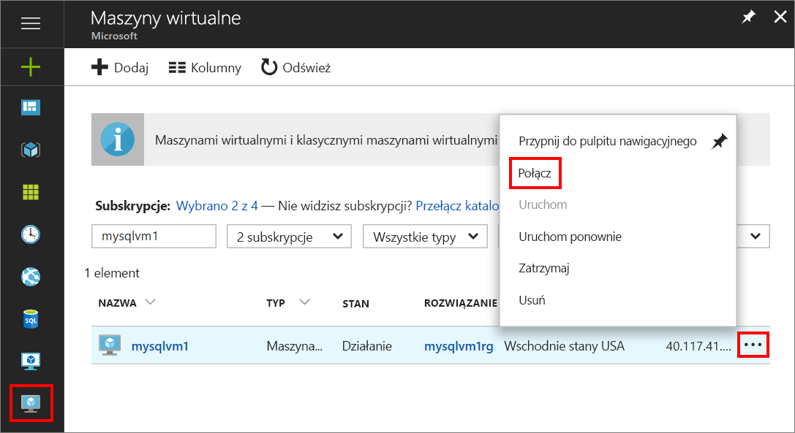
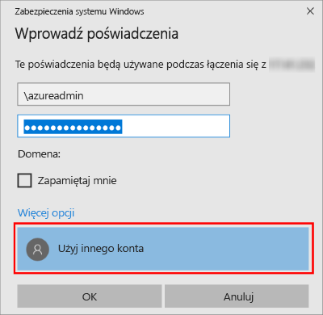

1. Po utworzeniu i uruchomieniu maszyny wirtualnej platformy Azure kliknij ikonę Maszyny wirtualne w witrynie Azure Portal, aby wyświetlić swoje maszyny wirtualne.

1. Kliknij przycisk wielokropka ( **...** ) dla nowej maszyny wirtualnej.

1. Kliknij przycisk **Połącz**.

   

1. Otwórz plik **RDP**, który przeglądarka pobiera dla maszyny wirtualnej.

1. Funkcja Podłączanie pulpitu zdalnego powiadomi, że nie można zidentyfikować wydawcy tego połączenia zdalnego. Kliknij pozycję **Połącz**, aby kontynuować.

1. W oknie dialogowym **Zabezpieczenia systemu Windows** kliknij pozycję **Użyj innego konta**. Może być konieczne kliknięcie pozycji **Więcej opcji**, aby ją wyświetlić. Podaj nazwę użytkownika i hasło, które zostały skonfigurowane podczas tworzenia maszyny wirtualnej. Musisz dodać ukośnik odwrotny przed nazwą użytkownika.

   

1. Kliknij przycisk **OK**, aby nawiązać połączenie.
